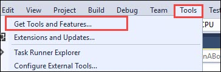
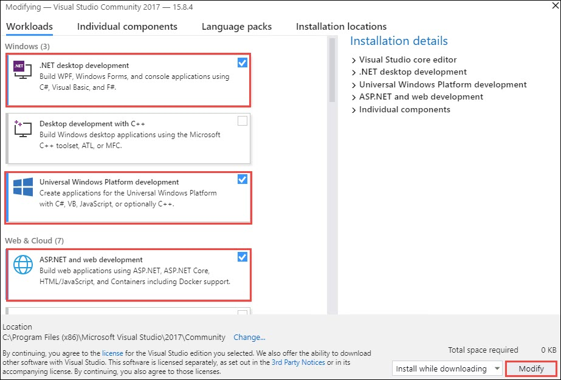

# Introduction
In this workshop, attendees will implement an IoT solution for intelligent vending machines, leveraging facial feature recognition and Azure Machine Learning, to gain a better understanding of building cloud-based machine learning app, and real-time analytics with SQL Database in-memory and columnar indexing.   
# Sign-up for Workshop Environment

To make it easier for you to work on the labs, you are provided with pre-provisioned Azure environment. You will receive sign-up link for the lab environment from your instructor. 

* Register for the lab environment by providing your information and clicking on **Submit** button.

* On the next page, click the **Launch Lab** button.
 
* Wait for the lab environment to be provisioned. Sometimes this can take upto **10 minutes**. Once environment provisioning is complete, you will receive details in email as well as in the browser.
 
 > Note: Lab environment is enabled only for specific duration or workshop end time - whichever is earlier. At the end of the allowed time, environment will be self-destructed. Also, for multi-day workshops, all virtual machines will be shutdown at 7 PM local time and start at 8AM local time.  

# Verify the pre-provisioned Environment

## Verify Azure Access

Open a browser instance in private or incognito mode and login to [Microsoft Azure Portal](https://portal.azure.com) using the credentials provided.In Azure portal you can navigate to the Resource groups to see the pre-deployed Resource group.
* You should use the existing Resource group during the lab.

> Note: You might have an existing Azure Credential. For the pre-provisioned environment, new Microsoft Azure environment is provisioned and new AAD user is created for you. To prevent conflict with your existing accounts, it is advised to use In Private mode of IE / IE Edge or Incognito mode of Chrome browser.

## Verify Virtual Machine

You are provided a Visual Studio Community 2017 on Windows Server 2016 with additional softwares configured. FQDN of the virtual machine and administrator credentials are provided in the lab details page. You can remote into the virutal machine using the provided credentials and validate the following:

> Note: Visaul studio Virtual Machine is provisioned in the resource group, in which you have access. Once you login to Microsoft Azure Portal, you can navigate to this VM to find more details.

## Verify the pre-requisite Azure resources
Following azure resources are created for you in advance, Please use them instead of creating more resources. 
  
1. **Virtual Machine** 
2. **Network Security Group**
3. **Virtual Network**
4. **Public IP**
5. **Network Interface**

## Notes to Attendees
**Please follow the below steps before starting the lab.** 
1. Login to the virtual machine using the given credentials.Then, open **Visual Studio** and **Sign-in** with the Azure credentials given in the lab details page.
2. Add the ASP.NET and web development, Universal Windows Platform Development and .NET Desktop Development workloads by:
    * Using the Tools menu bar.  
 <kbd></kbd>
    * Once the Visual Studio Installer launches, select all the 3 workloads, and then choose Modify. 
 <kbd></kbd>
3. The above step will take around 10-15 minutes to complete. Now open the **Downloads** folder in the desktop and move Bot Controller.zip and Bot Dialog.zip folders to "Documents\Visual Studio 2017\Templates\ItemTemplates\Visual C#" and Bot Application.zip folder to "Documents\Visual Studio 2017\Templates\ProjectTemplates\Visual C#"
4. Attendees can navigate to https://aka.ms/biadstudent to get the lab related files.
# Known Issues
### Failure while updating Microsoft.Bot.builder package:
(Lab 1 > Step 7)

> **Possible Solutions**:

 * If you are getting this issue don't go for the latest version of the package, select version 3.16.1.38846.

### Showing error with  QnaDialog.cs file :
(Lab 1.1 > Creating and Connecting a Bot to QnA Maker Service)
> **Possible Solutions**:

 * Try installing **Microsoft.Bot.Builder** package for that project also.  

# Notes to Instructors / Proctors
* Attendees should use Free tier while creating QnA Maker. Use other small tiers only if free is not available.
* Attendees can refer **Registration Page/Email** for the details of the resources deployed.   

# Help and Support

If you require any help during the workshop, please reach out to the instructor / proctors. Instructors / proctors might escalate the issue to remote support team, at that time, please pass on your AAD User ID (aad_user_xyz), so that it is easier to look up your environment.

