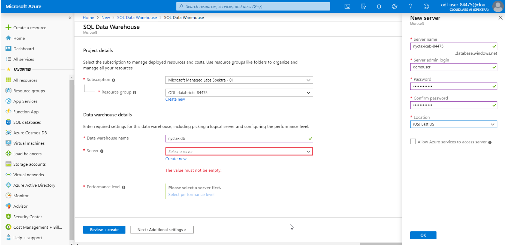
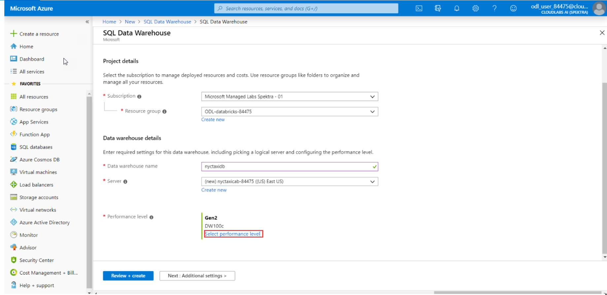
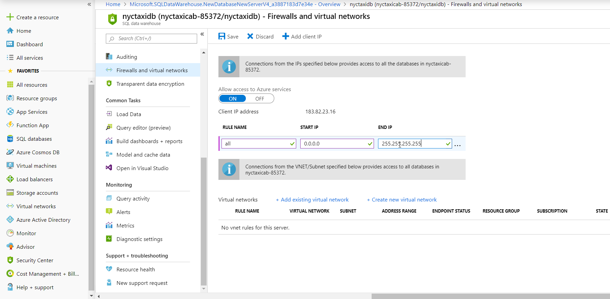
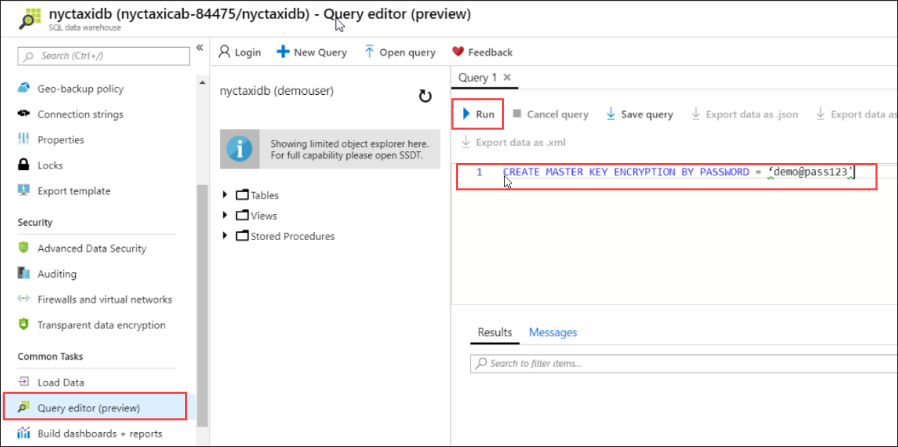
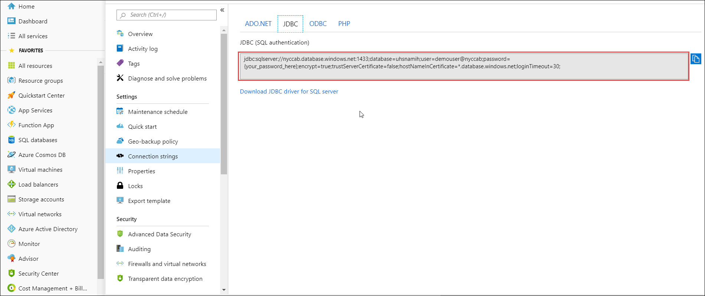
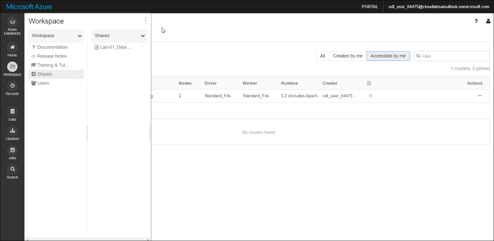
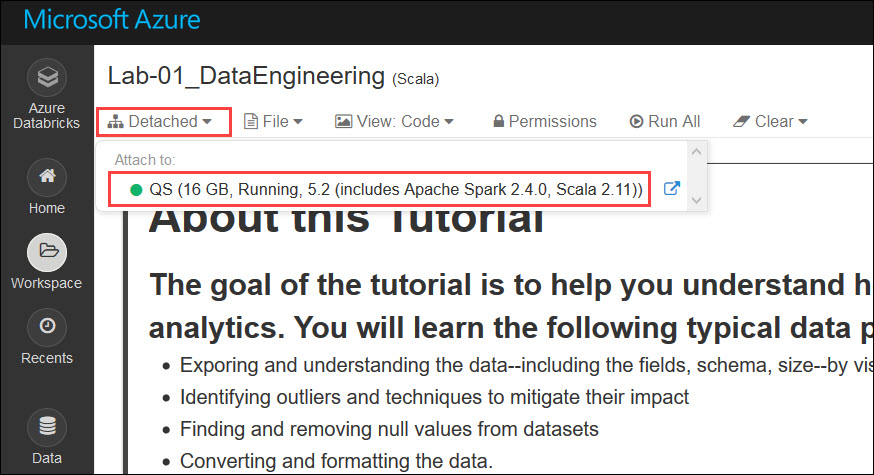
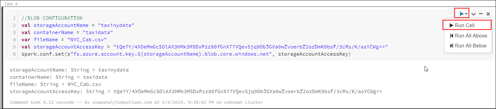

# Azure Databricks - SparkSql & Performance Optimization

**Azure Databricks** is an Apache Spark-based big data analytics and machine learning framework optimized for the Microsoft Azure Cloud.
Databricks is integrated with Azure to provide one-click setup, streamlined workflows, and an interactive workspace that enables collaboration between data scientists, data engineers, and business analysts.

This tutorial helps you understand how to use Azure Databricks Spark to prepare raw data for analytics.

# Getting Started

Follow these instruction to set up the lab environment for the lab.
## Step 1: Deploy Sql Data Warehouse.

1. **Login** to [Azure portal](https://portal.azure.com) using the credentials provided in the environment details page. You will be having access to one resource group. 
2. **Select** Create a Resource  search for **Sql Data Warehouse** select Create, add the details as follows:
    * **Select** the Pre-created Resource group 
    * **Data Warehouse name**: nyctaxidb
    * In server **Create new** add the credentials as follows:
      * **Server name**: nyctaxicab-**SUFFIX**
      * **Server Admin Login**: demouser
      * **Password**: demo@pass123
      * **Select** the location used in your Resource group
     * **Allow** Azure services to access server
   
   <kbd></kbd>  
3. In **Performance level** Select **Gen2 DW100c**.
   <kbd></kbd>  
4. Go to Data Warehouse , go to **security** select **Firewalls and virtual networks**
     * **Rule Name**: all
     * **START IP**: 0.0.0.0
     * **END IP**: 255.255.255.255
     * **Save**
   <kbd></kbd>    
5. In **Sql Data Warehouse** go to **Query editor** insert the query:  
    **CREATE MASTER KEY ENCRYPTION BY PASSWORD='your password'**
    <kbd></kbd>  
6. In **Sql DataWarehouse** go to **Connection strings** copy the **JDBC** url and save it for later use.
    <kbd></kbd>  
   
   

## Step 2: Verify the resources.

1. **Open** the resource group and you can find a **Databricks workspace** already deployed.  
<kbd></kbd>  
2. Go to the Azure Databricks workspace, and then click on **Launch Workspace**.  
<kbd></kbd>  
3. You are now inside your Databricks workspace.  
<kbd></kbd>

## Step 3: Attach the Notebook to your cluster.

1. **Open** the Databricks Workspace. 
2. Click on **Clusters** tab to view the available Databricks Clusters. **Start** the cluster if it is in terminated state.  
<kbd></kbd>  
3. Now let's **Click** on the **Workspace** tab and open the folder named **Shared**, where you can find SparkSql & Performance Optimization notebook. Open the  notebook.  
<kbd></kbd>  
4. Click on **`detached`** written on the top-left corner, and you'll see a list of active clusters.  
<kbd></kbd>  
5. **Attach** your notebook to a running cluster. A green icon shall appear on top, meaning our notebook is now attached to our cluster and is ready to be executed. Now you need to follow the instructions specified in each of the Notebooks.

### Your Databricks Environment is ready now and you can proceed with the labs.
1. **Open** the Databricks Workspace. 
2. **Click** on the **Workspace** tab, open the folder named **Shared**, where you can find multiple Notebooks. **Open** the first notebook named **Lab-01_DataEngineering**.  
<kbd></kbd>  
3. **Attach** the cluster in to this Notebook, if you haven't attached it yet. 
4. Follow the instructions in the notebook to continue with the lab. To run the cells in the Notebook, **Click** on the **Play** button in the top right corner of that cell and then **Click** on **Run Cell**  
<kbd></kbd> 
