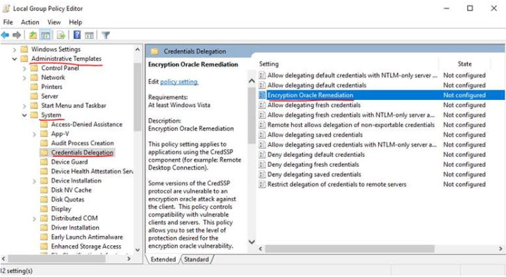
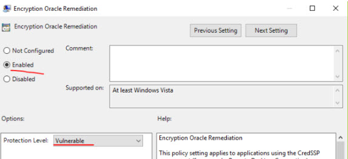

# Overview
Due to recent change, you might get the following issue in rdp connection.
* An authentication error has occurred.
  The function requested is not supported.  
  This could be due to CredSSP encryption oracle remediation.
  For more information, see https://go.microsoft.com/fwlink/?linkid=866660
  
  <kbd></kbd>
  
## Following is fix for this: 
* You can run the following dos command to make change in in registry setting
    > REG  ADD HKLM\Software\Microsoft\Windows\CurrentVersion\Policies\System\CredSSP\Parameters\ /v AllowEncryptionOracle /t REG_DWORD /d 2
    
* You can read more about this at https://blogs.technet.microsoft.com/mckittrick/unable-to-rdp-to-virtual-machine-credssp-encryption-oracle-remediation/

* If you cannot RDP to  VMs from your patched client, we can consider changing the policy settings on the client to temporarily gain RDP access to the servers. You can change the settings in Local Group Policy Editor. Execute gpedit.msc and browse to Computer Configuration / Administrative Templates / System / Credentials Delegation in the left pane:
 <kbd></kbd>
 
* Change the Encryption Oracle Remediation policy to Enabled, and Protection Level to Vulnerable:
  <kbd></kbd>
