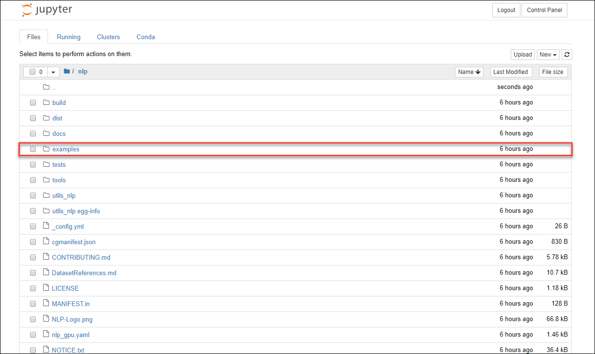
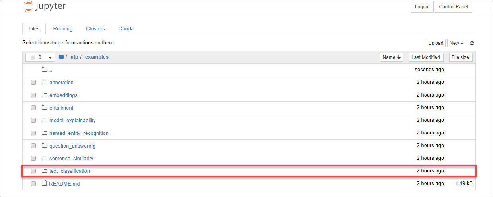
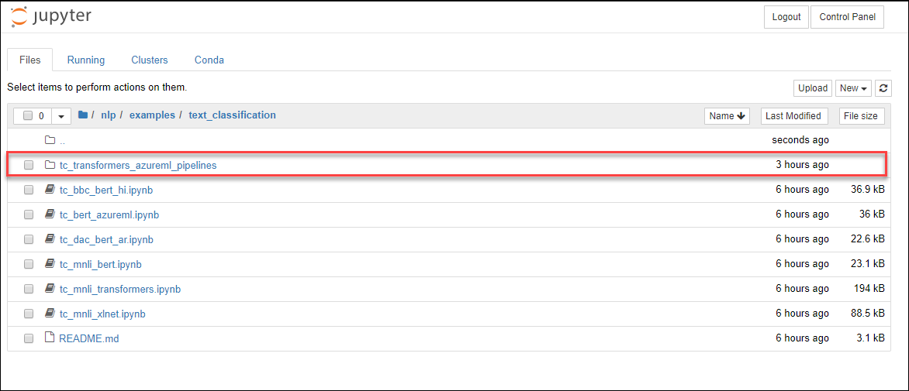

# Login to your Jupyterhub Portal.
In this exercise you will Log into your **jupyterhub portal** using your labvm username and Password from your Environment details page.
1. Click on Environment Details Tab on this Page to view your Azure Lab credentials details. Use these details to login into the JupyterHub Portal. 
      
### Login to Jupyterhub Portal
1. Copy the **jupyterhub URL** from your Lab credentials details page and navigate it in a new tab.
      
1. Enter your Labvm Admin Username and Labvm Admin Password from your Lab credentials details page in the Jupyterhub login page and click on **Sign In** button.

     
1. Now you will be able to see your jupyterhub portal home page. Select the **nlp** folder on jupyterhub portal.
     
1. Select **examples** folder.
     
1. Select **text_classification** folder.
     
1. Open folder **tc_transformers_azureml_pipelines**.
     
1. Click on **tc_transformers_azureml_pipelines.ipynb**.
     
1. After clicking on **tc_transformers_azureml_pipelines.ipynb**, a new tab will open and you will see a pop-up to select kernal.
     
1. Select **npl_gpu** kernal from drop down menu and click on **Set Kernal**.
     
1. Please make sure **npl_gpu** cluster is selected on your notebook before running any command in notebook.
        
1. You can click anywhere in the cell and execute it by entering **shift + enter** on your keyboard.
1. Follow all the steps from notebook to finish the exercise.
