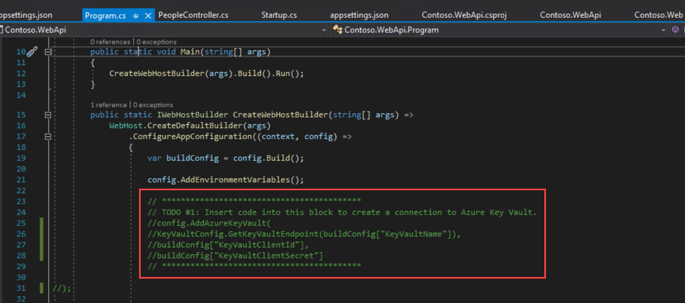
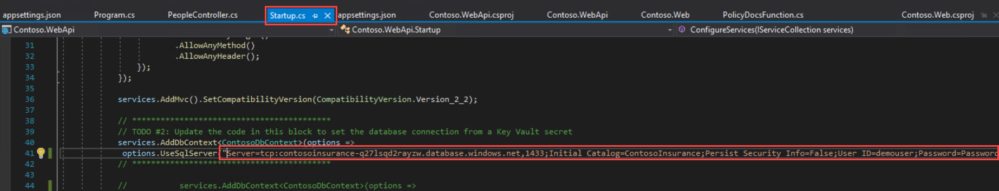

# Introduction

This is a supplement guide to  ‘Microsoft Cloud Workshop - [App-modernization](https://github.com/Microsoft/MCW-App-modernization/blob/master/Hands-on%20lab/HOL%20step-by-step%20-%20App%20modernization.md)’, to be used when you are delivering a hands-on-lab session using Cloud Labs AI platform from Spektra Systems. If you have any questions, please reach out to cloudlabs-support@spektrasystems.com
 
 # Verify the pre-provisioned Environment
 1. Launch a browser using incognite or in-private mode, and navigate to https://portal.azure.com. Once prompted, login with the Microsoft Azure credentials you received.   

2. Once you are logged in to the portal, navigate to Resource Groups. 

3. Note that you have access one resource group – ODL_App-xxxxx-01. Note: ODL_ARM-xxxxx-01 has the pre-deployed environment and you will also use **ODL_App-xxxxx-01** to deploy new resources. 

4. Navigate to the resource group **ODL_App-xxxxx-01** and view the already existing resources such as LABVM Virtual Machine, Disk, etc.

* **LABVM** has been configured with the following:
  1. IE Enhanced Security has been disabled
  2. SQL Server Express 2017
  3. SQL Server Management Studio 2017
  4. Files are downloaded into **C:\MCW**

5. Users can select **LABVM** and click on **Connect** to download the RDP file
* Open the RDP file to connect to the LABVM. Provide the credentials you received to login to the VM
* Once you login to the LABVM, server manager will open. Select Local Server and verify that IE Enhanced Security Configuration has also been turned off
6. Now go to C:\MCW and verify the student files are there.
 
## Verify Azure Access

Open a browser instance in private or incognito mode and login to [Microsoft Azure Portal](https://portal.azure.com) using the credentials provided.

> Note: You might have an existing Azure Credential. For the pre-provisioned environment, new Microsoft Azure environment is provisioned and new AAD user is created for you. To prevent conflict with your existing accounts, it is advised to use In Private mode of IE / IE Edge or Incognito mode of Chrome browser.

## Verify Virtual Machine

You are provided a Visual Studio Community 2017 on Windows Server 2016 (x64)Microsoft with additional softwares configured.FQDN of the virtual machine and administrator credentials are provided in the lab details page. You can remote into the virutal machine using the provided credentials.

> Note: VM is provisioned in the resource group, in which you have access. Once you login to Microsoft Azure Portal, you can navigate to this VM to find more details.

# Known Issues

* In Exercise 4 - Task 5 - Step 8 - On publishing Contoso.WebApi Project, it may give HTTP 500 error in step 8. 
Solution - Follow the following steps and Publish Contoso.WebApi project again.
1. In Exercise 4 - Task 3 - Step 2 - Comment the whole TODO1 part as shown below and then save it.
  
 
2. In Exercise 4 - Task 3 - Step 6 - After adding code to TODO2, add connection string of SQL Database as shown below, then save the file.
  

* In Exercise 5 - Task 1 - Users can face issue with Provision function app, **consumption tier is not existing in resource group**, In this case Users can select different region it will work.

* In Exercise 5 - Task 2 - Step 10 - If users find that the policy holder data is not fetched, then first Build the solution and then Publish it. Then sign in the webapp again.

* In Exercise 8 - Task 1 - Step 4 - Users open the solution file,after opening the solution file, it will show one error, users should ignore and can continue.

* Exercise 9 - Task 3 - Users can deploy the web app and verifying it. It will only publish the web app. Users have to skip steps 6-8.

# Notes to Instructors / Proctors

* **Exercise 3 - Task 3**: Users have to skip Step 6 and Step 7 as a pre-created Service Principal is provided. Details of the pre-creteated Service Principal are available on environment details page.

* Users should use the Azure Credentials given to them to login to Visual Studio.

* Users should always open the visual studio **Run as administrator**.

# Help and Support

If you require any help during the workshop, please reach out to the instructor / proctors. Instructors / proctors might escalate the issue to remote support team, at that time, please pass on your AAD User ID (aad_user_xyz), so that it is easier to look up your environment.
