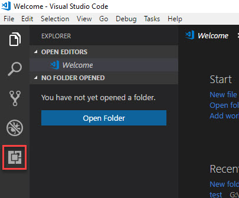
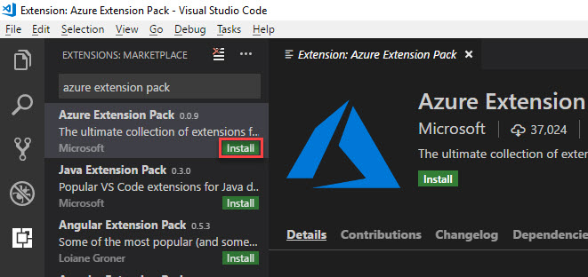

# Install Visual studio code Azure Extension Pack
-------------------------------------------------
 1.	Launch Microsoft visual studio code by searching code in start menu.
 2.	Click on Extension icon or use Ctrl+Shift+X keys to explore extensions.
    <kbd></kbd>
 3.	Search for Azure Extension pack. Then click on Install.
    <kbd></kbd>
 4.	It will take few minutes. After that go can go ahead on your solution template.
