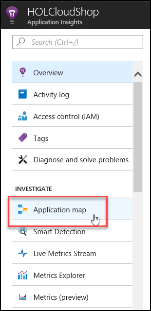
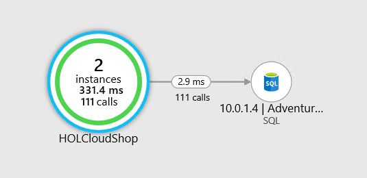

# Introduction

Azure security and management is a one day workshop lead by Microsoft or Microsoft partners.Student will deploy and monitor a web application that has been deployed to Azure IaaS in this Hands-on Lab (HOL). Azure security and management services will be used to manage and monitor the operational performance and security of the underlying infrastructure. Azure Application Insights will be used to monitor performance, application usage, and identify the cause of any application issues that emerge.

Azure services and related products

* Azure Monitor
* Log Analytics
* Azure VMs
* Azure Application Insights
* Azure Security Center

 
# Sign-up for Workshop Environment

To make it easier for you to work on the labs, you are provided with pre-provisioned Azure environment. You will receive sign-up link for the lab environment from your instructor. 

* Register for the lab environment by providing your information and clicking on **Submit** button.

* On the next page, click the **Launch Lab** button.
  
* Wait for the lab environment to be provisioned. Sometimes this can take upto **30 minutes**. Once environment provisioning is complete, you will receive details in email as well as in the browser.
 
 > Note: Lab environment is enabled only for specific duration or workshop end time - whichever is earlier. At the end of the allowed time, environment will be self-destructed.
 
# Verify the pre-provisioned Environment

1. Launch a browser using incognite or in-private mode, and navigate to https://portal.azure.com. Once prompted, login with the Microsoft Azure credentials you received.   

2. Once you are logged in to the portal, navigate to Resource Groups. 
 
3. Note that you have access to four resource groups – **ODL_azure-security-xxxxx-01** - to - **ODL_azure-security-xxxxx-04**.    Resource group **ODL_azure-security-xxxxx-01 has the pre-deployed environment. Users need to deploy other resources in other RGs during the lab.

4. Navigate to the resource group **ODL_iaas-arch-xxxxx-01** and view the already existing resources such as **LABVM** Virtual Machine,         Vnet etc

5. Using a remote desktop client, open a Remote Desktop Session into the LABVM using the labvmdnsname and credentials you received
   Now check if exercise files for the hands-on lab are already downloaded in C:\HOL

## Verify Azure Access

Open a browser instance in private or incognito mode and login to [Microsoft Azure Portal](https://portal.azure.com) using the credentials provided.

> Note: You might have an existing Azure Credential. For the pre-provisioned environment, new Microsoft Azure environment is provisioned and new AAD user is created for you. To prevent conflict with your existing accounts, it is advised to use In Private mode of IE / IE Edge or Incognito mode of Chrome browser.

## Verify Virtual Machine

You are provided a Visual Studio Community 2017 on Windows Server 2016 (x64)Microsoft.FQDN of the virtual machine and administrator credentials are provided in the lab details page. You can remote into the virutal machine using the provided credentials.

> Note: LAB VM is provisioned in the resource group **ODL_azure-security-xxxxx-01**. Once you login to Microsoft Azure Portal, you can navigate to this VM to find more details.

# Known Issues

> **Possible Solutions**:

* With the release of the March 2018 Security bulletin, there was a fix that addressed a CredSSP, “Remote Code Execution” vulnerability (CVE-2018-0886) which could impact RDP connections. 
**Resolution**
Please follow the instructions under https://github.com/SpektraSystems/Microsoft-Cloud-Workshop/blob/master/RDP%20CredSSP/README.md  

* In **Exercise-4** **Task 1** after **Step 21** Users should follow below steps to proceed:

* **Step 22.** Click on **Open in MIcrosoft Azure Portal** 

  

* **Step 23.**  Click on **Application map** under Investigate menu.

  

* **Step 23.** You can now see application map as shown in following image:

  

* **Step 24.** Close the Application map pane, then Click on the Alerts in the Configure section.

 <kbd></kbd>

* **Now you can proceed with step 4 as per lab guide.**

# Notes to Instructors / Proctors
 

* For Exercise 1, Task 1 and 2 users should use the **ODL_iaas-arch-xxxxx-03** resource group.

* For Exercise 2, Task 1, Step 1 users should navigate the **ODL_iaas-arch-xxxxx-02** resource group and use the already deployed         resources like ADVM. 

* For Exercise 2, Task 1 users should use the **ODL_iaas-arch-xxxxx-04** resource group for creating first and second VM, ***Note***:-  **Location should be same for the VM as per the location of LitwareVNET**.

* For Exercise 2, Task 2 users should use the **ODL_iaas-arch-xxxxx-06** resource group creating third and fourth VM. ***Note*** :-**Location should be same the VM as per the location of LitwareVNET2**.

* For configure **Backup** users should use **ODL_iaas-arch-xxxxx-05** and **ODL_iaas-arch-xxxxx-07** Resource groups and for more  details please go through **Known Issues**.

* For Exercise 3, Task 1 users should use **ODL_iaas-arch-xxxxx-08** Resource group for deploy the template. ***Note***:-Use **ODL_iaas-arch-xxxxx-02** for Existing Virtual Network LitwareVNET.

* For Exercise 3, Task 2, Step 5 and 6 user should replace the resource group name **LitwareCloudshopRG** with **ODL_iaas-arch-xxxxx-08** and also Replace **SQLAVSet** with **SQLAvSet**.

* For Exercise 3, Task 3 user should use again **ODL_iaas-arch-xxxxx-08** resource group for deploy the template and use **ODL_iaas-arch-xxxxx-02** for the exixting Virtual Network LitwareVNET.

* For Exercise 4, Task 1 user should replace the Resource group name **LitwareCloudShopRG** with **ODL_iaas-arch-xxxxx-08**.

* For Exercise 5, Task 1 user should navigate the **ODL_iaas-arch-xxxxx-08** resource group.

# Help and Support

If you require any help during the workshop, please reach out to the instructor / proctors. Instructors / proctors might escalate the issue to remote support team, at that time, please pass on your AAD User ID (aad_user_xyz), so that it is easier to look up your environment.

  
