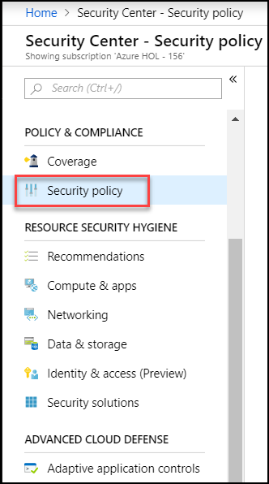
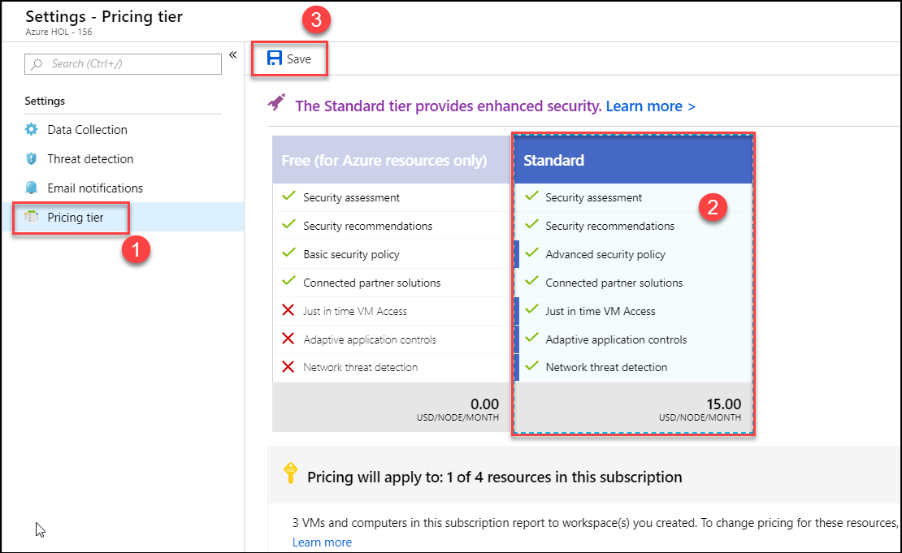
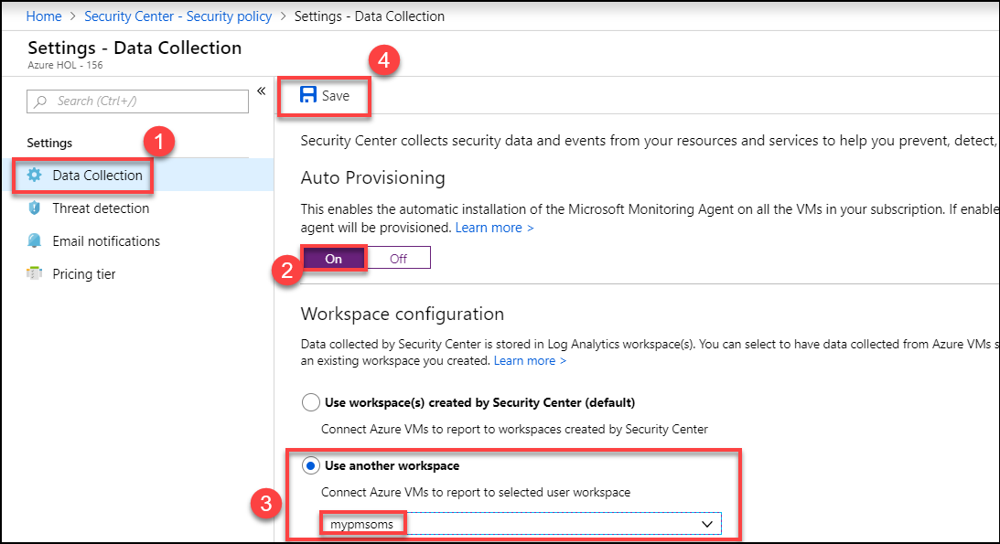

# Introduction

This is a supplement guide to ‘Microsoft Cloud Workshop - [Azure Security and Management](https://github.com/Microsoft/MCW-Azure-security-and-management/blob/master/Hands-on%20lab/HOL%20step-by-step%20-%20Azure%20security%20and%20management.md)’, to be used when you are delivering a hands-on-lab session using Cloud Labs AI platform from Spektra Systems. If you have any questions, please reach out to cloudlabs-support@spektrasystems.com

Azure security and management is a one day workshop lead by Microsoft or Microsoft partners.Student will deploy and monitor a web application that has been deployed to Azure IaaS in this Hands-on Lab (HOL). Azure security and management services will be used to manage and monitor the operational performance and security of the underlying infrastructure. Azure Application Insights will be used to monitor performance, application usage, and identify the cause of any application issues that emerge.

Azure services and related products

* Azure Automation
* Azure Monitor
* Azure Log Analytics
* Change Tracking
* Update Management
* Security Center
* Service Map
* Application Insights
* Virtual machines
 
# Verify the pre-provisioned Environment

1. Launch a browser using incognite or in-private mode, and navigate to https://portal.azure.com. Once prompted, login with the Microsoft Azure credentials you received.   

2. Once you are logged in to the portal, navigate to Resource Groups. 
 
3. Note that you have access to one resource group – **ODL_azure-security-xxxxx-01** which has the pre-deployed environment. Users need to deploy other resources/Resource Groups during the lab.

4. Navigate to the resource group **ODL_azure-security-xxxxx-01** and view the already existing resources such as **LABVM** Virtual Machine, Vnet etc.

5. Using a remote desktop client, open a Remote Desktop Session into the LABVM using the labvmdnsname and credentials you received
   Now check if exercise files for the hands-on lab are already downloaded in **C:\HOL**

## Verify Azure Access

Open a browser instance in private or incognito mode and login to [Microsoft Azure Portal](https://portal.azure.com) using the credentials provided.

> Note: You might have an existing Azure Credential. For the pre-provisioned environment, new Microsoft Azure environment is provisioned and new AAD user is created for you. To prevent conflict with your existing accounts, it is advised to use In Private mode of IE / IE Edge or Incognito mode of Chrome browser.

## Verify Virtual Machine

You are provided a Visual Studio Community 2017 on Windows Server 2016 (x64)Microsoft.FQDN of the virtual machine and administrator credentials are provided in the lab details page. You can remote into the virutal machine using the provided credentials.

> Note: LAB VM is provisioned in the resource group **ODL_azure-security-xxxxx-01**. Once you login to Microsoft Azure Portal, you can navigate to this VM to find more details.

# Known Issues

# Notes to Attendees

>  Note: The Graphical User Interface (GUI) has changed for Security Center so please follow below steps:

* For [Excercise 3, Task 2](https://github.com/Microsoft/MCW-Azure-security-and-management/blob/master/Hands-on%20lab/HOL%20step-by-step%20-%20Azure%20security%20and%20management.md#task-2-explore-security-center): **Explore Security Center** please follow the below steps to change the pricing tier to Standard:

1. Select **Security Policy** under POLICY and COMPLIANCE

   

2. You will see your subscription now, then click on **Edit setting**  option

   

3. Select **Pricing tier** option under Settings menu,  then click on **Standard Pricing tier** and then click on **Save** button.

   

4. Close the panel and navigate back to the **Security Center** Overview screen. Click on **Security policy** under the POLICY and COMPLIANCE . This is where you will enable data collection.

a. This presents the Data Collection screen. Turn on data collection by clicking the On button, selecting **Use another workspace** and selecting the Log Analytics workspace created in Task 1: Provision Log Analytics and then clicking **Save** and click on Yes if prompted.

  

# Notes to Instructors / Proctors

> Note: While doing Before the Hands-on-lab section, follow the below steps.

1. You need not to execute Task 1 and Task 2 in Before the Hands-on-lab section, since it is pre-created. You can use the pre-created resources during the lab.
2. You should perform Task 3. In this task, you will create a new Azure Portal dashboard.

# Help and Support

If you require any help during the workshop, please reach out to the instructor / proctors. Instructors / proctors might escalate the issue to remote support team, at that time, please pass on your AAD User ID (aad_user_xyz), so that it is easier to look up your environment.

  
