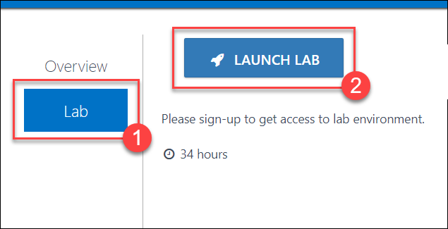
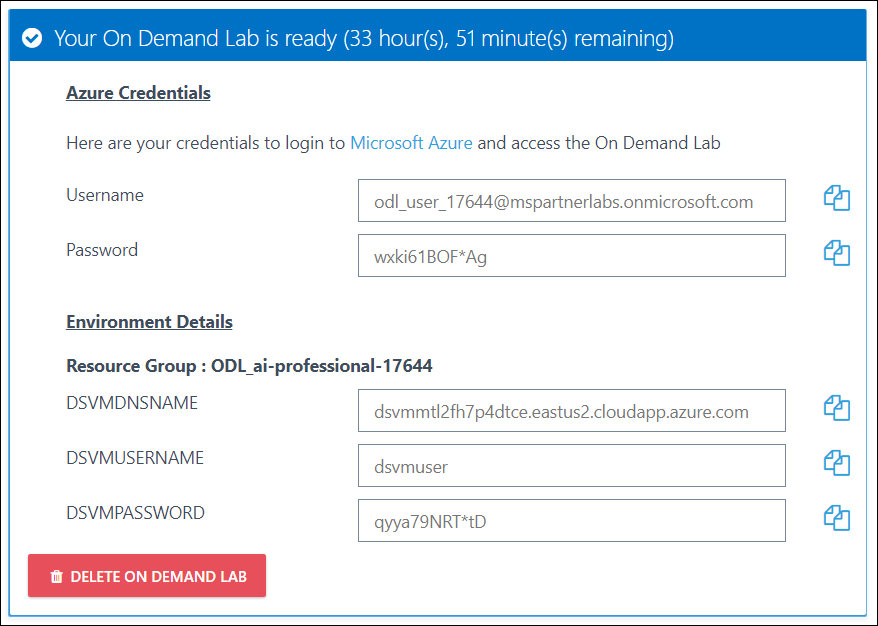
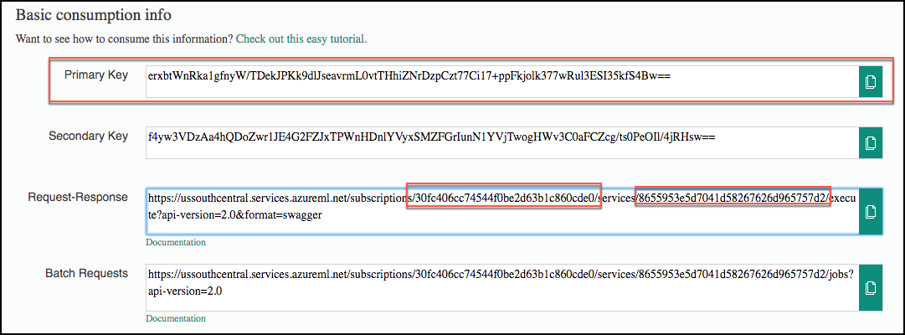
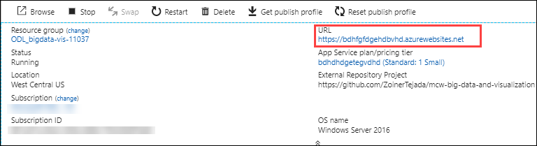
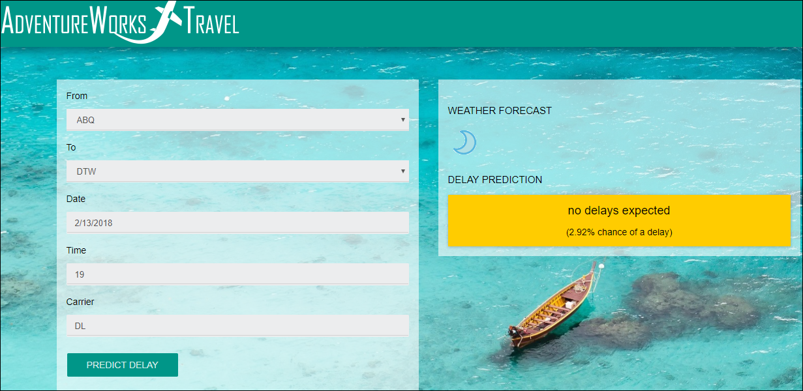

# Introduction

In this workshop, you will complete a web app using Machine Learning to predict travel delays given flight delay data and weather conditions, plan the bulk data import operation, followed by preparation tasks, such as cleaning and manipulating the data for testing, and training your Machine Learning model. You can find details about the worksohp [here](https://spektraazurelabs.blob.core.windows.net/bigdata-visualization/Hands-on lab step-by step - Big data and visualization-updated.docx).  

# Sign-up for Workshop Environment

To make it easier for you to work on the labs, you are provided with pre-provisioned Azure environment. You will receive sign-up link for the lab environment from your instructor. 

* Register for the lab environment by providing your information and clicking on **Submit** button.
 

* On the next page, click the **Launch Lab** button.
  
 
* Wait for the lab environment to be provisioned. Sometimes this can take upto **10 minutes**. Once environment provisioning is complete, you will receive details in email as well as in the browser.
 
 
 > Note: Lab environment is enabled only for specific duration or workshop end time - whichever is earlier. At the end of the allowed time, environment will be self-destructed.  

# Verify the pre-provisioned Environment

## Verify Azure Access

Open a browser instance in private or incognito mode and login to [Microsoft Azure Portal](https://portal.azure.com) using the credentials provided. In Azure portal you can navigate to the Resource groups to see the pre-deployed Resource group.
* You should use the existing Resource group during the lab.

> Note: You might have an existing Azure Credential. For the pre-provisioned environment, new Microsoft Azure environment is provisioned and new AAD user is created for you. To prevent conflict with your existing accounts, it is advised to use In Private mode of IE / IE Edge or Incognito mode of Chrome browser.

## Verify Data Science Virtual Machine

You are provided a [Data Science Virtual Machine - Windows 2016](https://azuremarketplace.microsoft.com/en-us/marketplace/apps/microsoft-ads.windows-data-science-vm) with additional softwares configured. FQDN of the virtual machine and administrator credentials are provided in the lab details page. You can remote into the virutal machine using the provided credentials and validate the following:

> Note: DSVM is provisioned in the resource group, in which you have access. Once you login to Microsoft Azure Portal, you can navigate to this VM to find more details.

## Verify the pre-requisite Azure resources
1. **Machine Learning Studio Workspace** is provisioned in the resource group, in which you have access.
2. **Azure HDInsight Cluster** : Refer registration page/email for cluster credentials and cluster ssh credentials. .  
3. **Virtual Network**
4. **Public IP**
5. **Network Interface**
6. **Load Balancer**
7. **Storage accounts**

## Notes to Attendees
While doing **Before the Hands-on-lab** section, follow the below steps.
1. You need not to execute **Task 1** in **Before the Hands-on-lab** section, since it is pre-created. You can use the pre-created resources during the lab.
2. You should perform **Task 2**. In this task, you will **register for a trial API account at WeatherUnderground.com**
3. Don’t deploy **Lab Virtual Machine** specified in **Task 3**, since it is pre-created.
4. Don’t install **PowerBi Desktop** specified in **Task 4**, since it’s preinstalled in DSVM.
5. Don’t install **SSH Client** specified in **Task 5**, since it’s preinstalled in DSVM.  

# Known Issues

### Failure while creating Data Factory

> **Possible Solutions**:

 * Check and ensure if the Data Factory Version used is V1.  

# Notes to Instructors / Proctors

###  Replace Exercise 7 with the following Exercise in this document

Instead of Exercise 7 in the lab guide, atendees should continue the lab with Exercise 7 provided in this document.  

# 7: Deploy intelligent web app
Duration: 20 minutes  
In this exercise, you will deploy an intelligent web application to Azure from GitHub. This application leverages the operationalized machine learning model that was deployed in Exercise 1 to bring action-oriented insight to an already existing business process.
## Task 1: Deploy web app from GitHub
1.	Open another tab in browser where you’ve logged to Azure
2.	**Launch** https://portal.azure.com/#create/Microsoft.Template/uri/https%3A%2F%2Fspektraazurelabs.blob.core.windows.net%2Fbigdata-visualization%2Fbigdatadeployapp.json URL in the newly opened tab, this will open azure portal deployment page.

3.	On the deployment page, ensure the fields are populated correctly. 
* Ensure that **Subscription** are selected.
*	Select the **Resource Group** that you have been using throughout this lab.
*	Enter a **sitename (must be unique)** and **site plan name**.
*	Leave **repoUrl** and **branch** as default.
*	Finally, enter the **ML API** and **Weather API** information. 
    *	Recall that you recorded the **ML API information** back in Exercise 1, Task 9.
        *	This information can be obtained on your Machine Learning web service page (https://services.azureml.net, then go to the **Consume** tab.
        *	The **Primary Key** listed is your ML API key
        *	In the Request-Response URL, the GUID after subscriptions/ is your **ML Workspace Id**
        *	In the Request-Response URL, the GUID after services/ is your **ML Service Id** 
         
    *	Also, recall that you obtained the **Weather API key** back in the Task 3 of the prerequisite steps for the lab. Insert that key into the Weather Api Key field. 
4.	Select **Next**, and on the following screen, **select Deploy**.
5.	The page should begin deploying your application while showing you a status of what is currently happening. 

> NOTE: If you run into errors during the deployment that indicate a bad request or unauthorized, verify that the user you are logged into the portal with an account that is either a Service Administrator or a Co-Administrator. You won’t have permissions to deploy the website otherwise.

6.	After a short time, the deployment will complete, then go to **Azure portal**, Select the deployed web app.
7. Copy the web app URL and navigate to the url by pasting it in a browser.
	
8.	You can find the chances of delay by providing **origin, destination, date, and time** in the application. Your newly deployed web application will look like this.

9.	Try with few different combinations of origin, destination, date, and time in the application. The information you are shown is the result of both the ML API you published, as well as information retrieved from the Weather Underground API.
10.	Congratulations! You have built and deployed an intelligent system to Azure.   
# After the hands-on lab 
Duration: 10 minutes  
In this exercise, attendees will deprovision any Azure resources that were created in support of the lab.
## Task 1: Delete resource group
1.	Using the Azure portal, navigate to the Resource group you used throughout this hands-on lab by selecting Resource groups in the left menu. 
2.	Search for the name of your research group and select it from the list. 
3.	Select Delete in the command bar and confirm the deletion by re-typing the Resource group name and selecting Delete. 
You should follow all steps provided after attending the Hands-on lab.  

# Help and Support

If you require any help during the workshop, please reach out to the instructor / proctors. Instructors / proctors might escalate the issue to remote support team, at that time, please pass on your AAD User ID (aad_user_xyz), so that it is easier to look up your environment.

