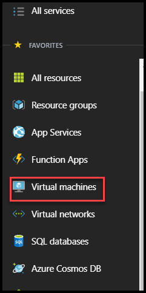
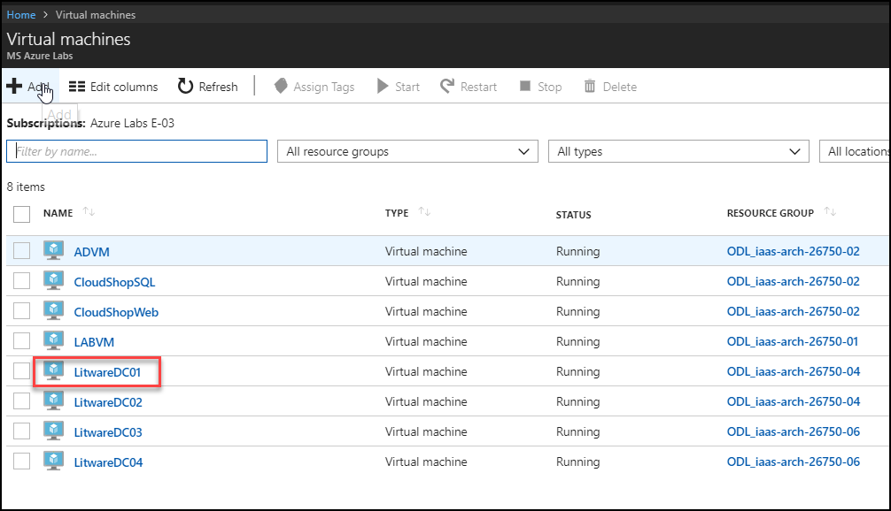
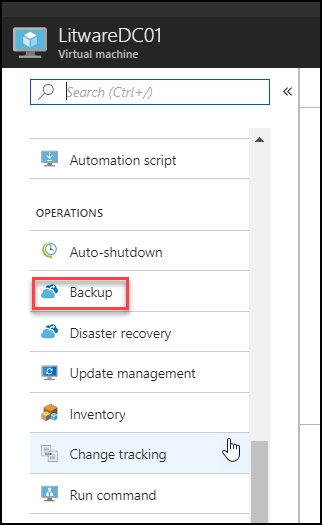
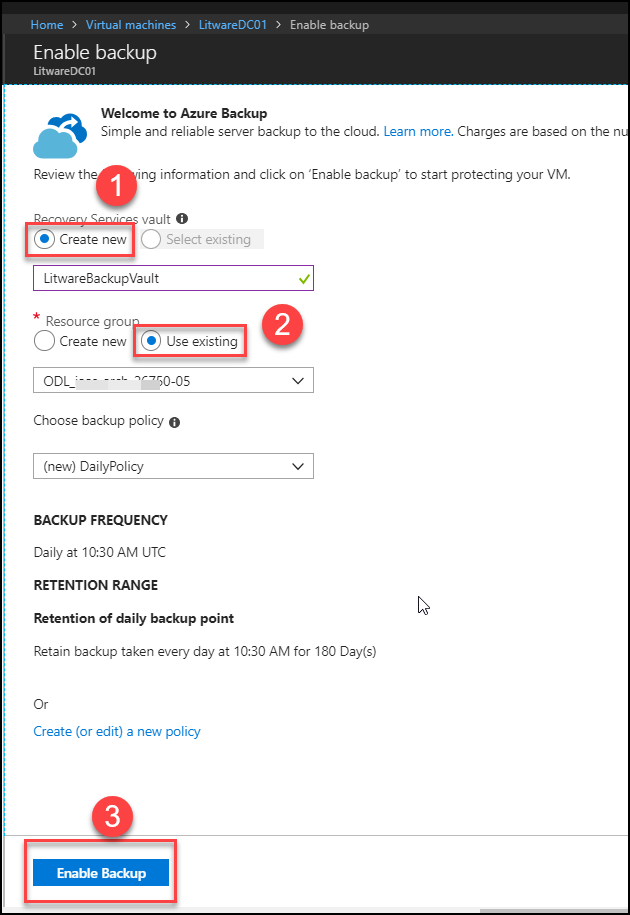
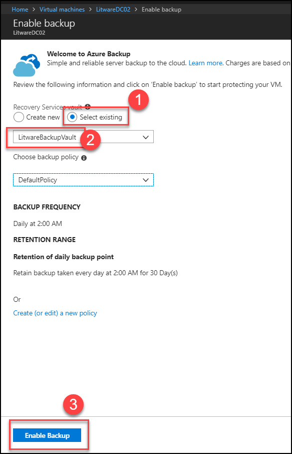
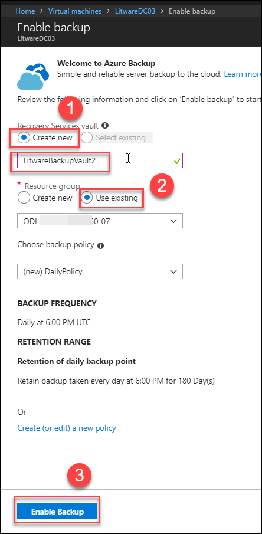
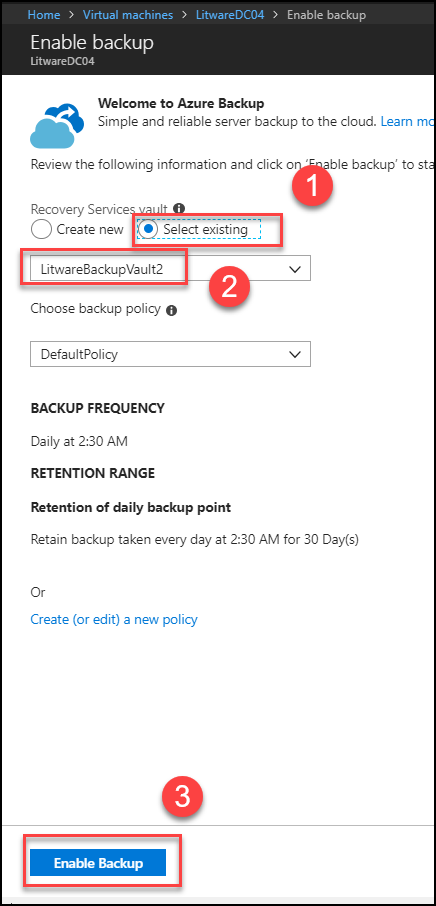

# Introduction

Building a Resilient IaaS architecture is a one day workshop lead by Microsoft or Microsoft partners. The student will assist a large organization in evaluating their current infrastructure deployments in Azure, and help identify single points of failure. Attention will be given to making the customer's current deployments more resilient and communicating best practices to ensure future deployments will follow best practices.
Attendees will be better able to design resilient applications in Azure, for high availability and disaster recovery. Specific attention will be given to:
 

*	The use of availability sets
*	The use of Managed Disks
*	Design principles when provisioning storage to VMs
*	Effective employment of Azure Backup to provide point-in-time recovery

 
# Sign-up for Workshop Environment

To make it easier for you to work on the labs, you are provided with pre-provisioned Azure environment. You will receive sign-up link for the lab environment from your instructor. 

* Register for the lab environment by providing your information and clicking on **Submit** button.

* On the next page, click the **Launch Lab** button.
  
* Wait for the lab environment to be provisioned. Sometimes this can take upto **30 minutes**. Once environment provisioning is complete, you will receive details in email as well as in the browser.
 
 > Note: Lab environment is enabled only for specific duration or workshop end time - whichever is earlier. At the end of the allowed time, environment will be self-destructed.
 
# Verify the pre-provisioned Environment

1. Launch a browser using incognite or in-private mode, and navigate to https://portal.azure.com. Once prompted, login with the Microsoft Azure credentials you received.   

 2. Once you are logged in to the portal, navigate to Resource Groups. 
 
 3. Note that you have access to eight resource groups – **ODL_iaas-arch-xxxxx-01** - to - **ODL_iaas-arch-xxxxx-08**.These two RGs **ODL_iaas-arch-xxxxx-01, ODL_iaas-arch-xxxxx-02** has the pre-deployed environment. User need to deploy other resources in other RGs during the lab.

 4. Navigate to the resource group **ODL_iaas-arch-xxxxx-01** and view the already existing resources such as LABVM Virtual Machine,         Disk, etc

 5.Using a remote desktop client, open a Remote Desktop Session into the LABVM using the labvmdnsname and credentials you received
   Now check if exercise files for the hands-on lab are already downloaded in C:\HOL

 6.Navigate to the resource group **ODL_iaas-arch-xxxxx-02** and view the already existing resources such as ADVM and CloudshopSQL,        CloudshopWeb Virtual Machines, Disk and LitwareVNET, etc.

## Verify Azure Access

Open a browser instance in private or incognito mode and login to [Microsoft Azure Portal](https://portal.azure.com) using the credentials provided.

> Note: You might have an existing Azure Credential. For the pre-provisioned environment, new Microsoft Azure environment is provisioned and new AAD user is created for you. To prevent conflict with your existing accounts, it is advised to use In Private mode of IE / IE Edge or Incognito mode of Chrome browser.

## Verify Virtual Machine

You are provided a Visual Studio Community 2017 on Windows Server 2016 (x64)Microsoft.FQDN of the virtual machine and administrator credentials are provided in the lab details page. You can remote into the virutal machine using the provided credentials.

> Note: LAB VM is provisioned in the resource group **ODL_iaas-arch-xxxxx-01**. Once you login to Microsoft Azure Portal, you can navigate to this VM to find more details.

# Known Issues

> **Possible Solutions**:

* With the release of the March 2018 Security bulletin, there was a fix that addressed a CredSSP, “Remote Code Execution” vulnerability (CVE-2018-0886) which could impact RDP connections. 
**Resolution**
Please follow the instruction under https://github.com/SpektraSystems/Microsoft-Cloud-Workshop/blob/master/RDP%20CredSSP/README.md  

* In **Exercise-2** **Task 2** While creating **Windows Server 2016 DataCenter VMs**, you may not see the option for **Enable Backup** so you can configure **Backup** after the deployment of VMs. In this case deploy the all four VMs first and then configure the Backup.

 Please follow these steps to configure **Backup** :

**Step 1.** Click on **Virtual Machines** 

  

**Step 2.**  Select **LitwareDC01** VM which is created by you.

  

**Step 3.** Click on **Backup** under Operations menu.

  

**Step 4.** Click on Create new **Recovery Service Vault** give name **LitwareBackupVault** and Select Existing RG **ODL_iaas-arch-xxxxx-05** and then click on **Enable backup**.

 

> **Repeat same Steps from  2 to 4** for **LitwareDC02** VM and select existing **RecoveryServiceVault** LitwareBackupVault.

 

> **Repeat same Steps from  2 to 4** for **LitwareDC03** and now Create new **RecoveryServiceVault** name as **LitwareBackupVault2**, Select existing RG **ODL_iaas-arch-xxxxx-07**.
 
 
 
 > **Also repeat same Steps from  2 to 4** for **LitwareDC04** and select existing **RecoveryServiceVault**  **LitwareBackupVault2**.

 

# Notes to Instructors / Proctors

* Please use the **same VM size** as per mentioned in **Lab guide** not go for other sizes as **policy** is applied so the deployment of   the VMs with other sizes will fail. 

* For Exercise 1, Task 1 and 2 users should use the **ODL_iaas-arch-xxxxx-03** resource group.

* For Exercise 2 Task 1 Step 1 users should navigate the **ODL_iaas-arch-xxxxx-02** resource group and use the already deployed       resources like ADVM. 

* For Exercise 2 Task 1 users should use the **ODL_iaas-arch-xxxxx-04** resource group for creating first and second VM **Location should be same   for the VM as per the location of LitwareVNET**.

* For Exercise 2, Task 2 users should use the **ODL_iaas-arch-xxxxx-06** resource group creating third and fourth VM **Location should be same   for the VM as per the location of LitwareVNET2**.

# Help and Support

If you require any help during the workshop, please reach out to the instructor / proctors. Instructors / proctors might escalate the issue to remote support team, at that time, please pass on your AAD User ID (aad_user_xyz), so that it is easier to look up your environment.

  
