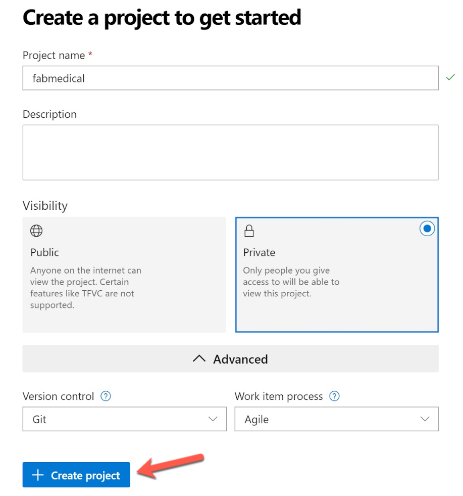

**In Exercise 2, [Task 8: Review Azure Monitor for Containers](https://github.com/microsoft/MCW-Containers-and-DevOps/blob/master/Hands-on%20lab/HOL%20step-by-step%20-%20Containers%20and%20DevOps%20-%20Developer%20edition.md#task-8-review-azure-monitor-for-containers)**

You will not be able to enable Insights for AKS cluster, Please skip this task and move to next task.

**Pre-Requisite:**
Once you receive the Lab Environment details after clicking on **Launch Lab**, perform the following task given below before starting with the main lab guide

In later exercises, you will need the Helm client to deploy to your Kubernetes cluster and run commands from your local machine.

1. For MacOS -- use homebrew:

    ```bash
    brew update

    brew install kubernetes-helm
    ```

2. For Windows -- using WSL _on your local machine (not the build agent)_:

    ```bash
    curl https://raw.githubusercontent.com/helm/helm/master/scripts/get > get_helm.sh
    chmod 700 get_helm.sh
    ./get_helm.sh
    ```

### Task 12: Download the FabMedical starter files

FabMedical has provided starter files for you. They have taken a copy of one of their websites, for their customer Contoso Neuro, and refactored it from a single node.js site into a website with a content API that serves up the speakers and sessions. This is a starting point to validate the containerization of their websites. They have asked you to use this to help them complete a POC that validates the development workflow for running the website and API as Docker containers and managing them within the Azure Kubernetes Service environment.

1. From WSL, download the starter files by typing the following curl instruction (case sensitive):

    ```bash
    curl -L -o FabMedical.tgz http://bit.ly/2nXeNla
    ```

    > **Important note**: If you'll be taking the Infrastructure edition of the lab, instead of using the above instructions, type the following ones:
    > 
    > ```bash
    > curl -L -o FabMedical.tgz http://bit.ly/2BvJ7GR
    > ```
    > 
    > This will download the version of the starter files that will be used by that edition of the lab.

2. Create a new directory named FabMedical by typing in the following command:

    ```bash
    mkdir FabMedical
    ```

3. Unpack the archive with the following command. This command will extract the files from the archive to the FabMedical directory you created. The directory is case sensitive when you navigate to it.

    ```bash
    tar -C FabMedical -xzf FabMedical.tgz --strip-components=1
    ```

4. Navigate to FabMedical folder and list the contents.

    ```bash
    cd FabMedical

    # on Mac bash you may need to type `ls`
    ll
    ```

5. You'll see the listing includes three folders, one for the web site, another for the content API and one to initialize API data:

    ```bash
    content-api/
    content-init/
    content-web/
    ```

6. Next log into your Azure DevOps account.

    If this is your first time logging into this account you will be taken through a first-run experience:

    - Confirm your contact information and select next.
    - Select "Create new account".
    - Enter a fabmedical-SUFFIX for your account name and select Continue.

7. Create repositories to host the code.

    - Enter fabmedical as the project name.
    - Ensure the project is Private.
    - Click the Advanced dropdown.
    - Ensure the Version control is set to Git.
    - Click the "Create Project" button.

        

    - Once the project creation has completed, use the repository dropdown to create a new repository by selecting "+ New repository".

        

    - Enter "content-web" as the repository name.

    - Once the project is created click "Generate Git credentials".

        

        - Enter a password.
        - Confirm the password.
        - Select "Save Git Credentials".

    - Using your WSL window, set your username and email which are used in Azure DevOps for Git Commits.

        ```bash
        git config --global user.email "you@example.com"
        git config --global user.name "Your Name"
        ```

        For example:

        ```bash
        git config --global user.email "you@example.onmicrosoft.com"
        git config --global user.name "you@example.onmicrosoft.com"
        ```

    - Using your WSL window, configure git CLI to cache your credentials, so that you don't have to keep re-typing them.

        ```bash
        git config --global credential.helper cache
        ```

    - Using your WSL window, initialize a new git repository.

        ```bash
        cd content-web
        git init
        git add .
        git commit -m "Initial Commit"
        ```

    - Setup your Azure DevOps repository as a new remote for push. You can copy the commands for "**HTTPS**" to do this from your browser.  Edit the HTTPS URL as given below:

       Remove characters between "https://" and "dev.azure.com" from HTTPS URL of the copied commands.
       For example:

       ```bash
       From this https URL
       "git remote add origin https://fabmedical-sol@dev.azure.com/fabmedical-sol/fabmedical/_git/content-web
        git push -u origin --all"

       Remove "fabmedical-sol@" from the above url to make it like below:
       "git remote add origin https://dev.azure.com/fabmedical-sol/fabmedical/_git/content-web
        git push -u origin --all"
       ```

       Paste these commands into your WSL window.

       - When prompted, enter your Azure DevOps username and the git credentials password you created earlier in this task.

    - Use the repository dropdown to create a second repository called "content-api".

    - Using your WSL window, initialize a new git repository in the content-api directory.

        ```bash
        cd ../content-api
        git init
        git add .
        git commit -m "Initial Commit"
        ```

    - Setup your Azure DevOps repository as a new remote for push. Use the repository dropdown to switch to the "content-api" repository. You can then copy the commands for the setting up the content-api repository from your browser, then update the HTTPS URL as you did earlier for content-web repository HTTPS url. Paste these commands into your WSL window.

        - When prompted, enter your Azure DevOps username and the git credentials password you created earlier in this task.

    - Use the repository drop down to create a third repository called "content-init".

    - Using your WSL window, initialize a new git repository in the content-init directory.

        ```bash
        cd ../content-init
        git init
        git add .
        git commit -m "Initial Commit"
        ```

    - Setup your Azure DevOps repository as a new remote for push.  Use the repository drop down to switch to the "content-init" repository. You can then copy the commands for the setting up the content-init repository from your browser, then update the HTTPS URL as you did earlier for other repo's HTTPS url's. Paste these commands into your WSL window.

      - When prompted, enter your Azure DevOps username and the git credentials password you created earlier in this task.

8. Clone your repositories to the build agent.

    - From WSL, connect to the build agent VM as you did previously in Before the hands-on lab - Task 6: Connect securely to the build agent using the SSH command.

    - In your browser, switch to the "content-web" repository and click "Clone" in the right corner.

        

    - Copy the repository url.

    - Update the repository url by removing the characters between "https://" and "dev.azure.com".

      For example: modify the repository url "https://fabmedical-sol@dev.azure.com/fabmedical-sol/fabmedical/_git/content-web"
      as "https://dev.azure.com/fabmedical-sol/fabmedical/_git/content-web"

    - Use the repository url to clone the content-web code to your build agent machine.

        ```bash
        git clone <REPOSITORY_URL>
        ```

    - In your browser, switch to the "content-api" repository and select "Clone" to see and copy the repository url and update the URL by removing some characters as you did earlier for content-web repository.

    - Use the repository url and `git clone` to copy the content-api code to your build agent.

    - In your browser, switch to the "content-init" repository and select "Clone" to see and copy the repository url and then update the url by removing some characters as you did earlier for other repositories.

    - Use the repository url and `git clone` to copy the content-init code to your build agent.

>**Note**: Keep this WSL window open as your build agent SSH connection. You will later open new WSL sessions to other machines.

You should follow all steps provided *before* performing the Hands-on lab.
