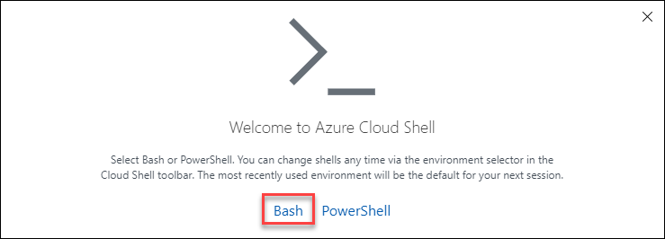
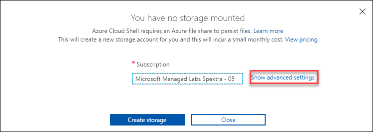
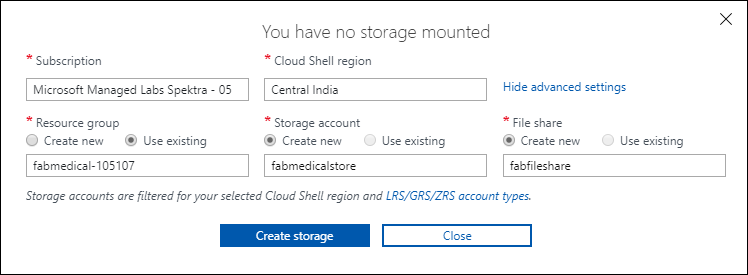
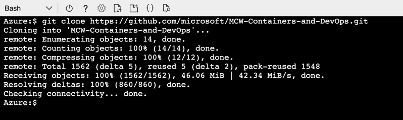
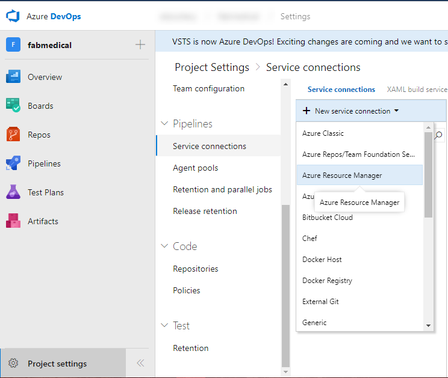
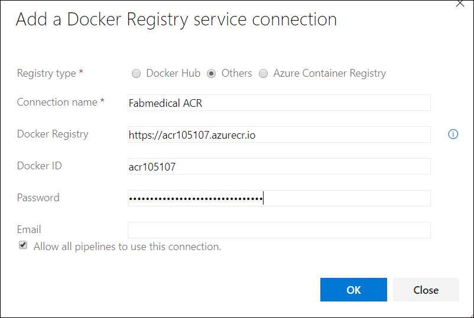
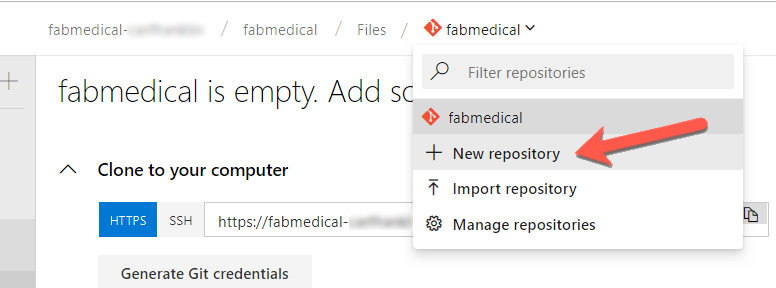
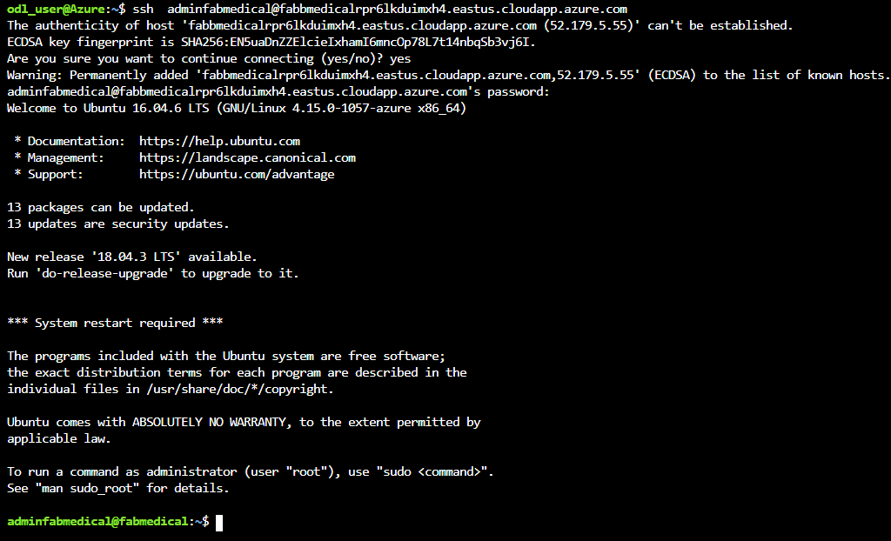
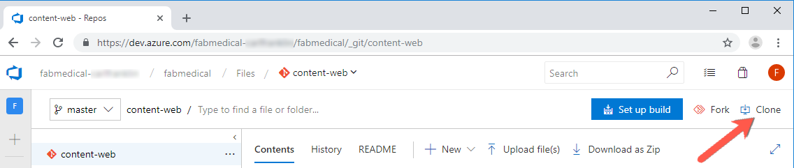

# Cloud-native applications before the hands-on lab setup guide

## Before the hands-on lab
You should follow all of the steps provided in this section _before_ taking part in the hands-on lab ahead of time as some of these steps take time.

### Task 1: Setup Azure Cloud Shell

1. Open cloud shell by selecting the cloud shell icon in the menu bar.

   

2. The cloud shell will open in the browser window Choose "Bash" if prompted.

      

3. Click on **show advanced settings**.

      

4. In **advanced settings** , select **Create new** for storage account and file share and fill the details 
     
      

5. Bash will start working now 

   
### Task 2: Download Starter Files

In this task you will use `git` to copy the lab content to your cloud shell so that the lab starter files will be available.

> **Note**: If you don't have cloud shell available, refer back to Task 1: Setup Azure Cloud Shell.

1. Type the following command and press `<ENTER>`:

   ```bash
   git clone https://github.com/microsoft/MCW-Containers-and-DevOps.git
   ```

2. The lab files will download.

   

3. We do not need the `.git` folder and later steps will be
   less complex if we remove it. Run this command:

   ```bash
   rm -rf MCW-Containers-and-DevOps/.git
   ```


### Task 3: Setup Azure DevOps project

FabMedical has provided starter files for you. They have taken a copy of one of their websites, for their customer Contoso Neuro, and refactored it from a
single node.js site into a website with a content API that serves up the speakers and sessions. This is a starting point to validate the containerization of their websites. They have asked you to use this to help them complete a POC that validates the development workflow for running the website and API as Docker containers and managing them within the Azure Kubernetes Service environment.

1. Open a **new** Azure Cloud Shell console.
2. Navigate to FabMedical source code folder and list the contents.

   ```bash
   cd ~/MCW-Containers-and-DevOps/Hands-on\ lab/lab-files/developer/
   ll
   ```

   > **Important note**: If you will be taking the Infrastructure edition of the lab, instead of using the above instructions, type the following ones:
   >
   > ```bash
   > cd ~/MCW-Containers-and-DevOps/Hands-on\ lab/lab-files/infrastructure/
   > ll
   > ```
   >
   > This will take you to the version of the starter files that will be used by that edition of the lab.

3. You'll see the listing includes three folders, one for the web site, another
   for the content API and one to initialize API data:

   ```bash
   content-api/
   content-init/
   content-web/
   ```

4. Set your username and email which are used for git commits.

   ```bash
   git config --global user.email "you@example.com"
   git config --global user.name "Your Name"
   ```

5. Configure git CLI to cache your credentials, so that you don't have to keep
   re-typing them.

   ```bash
   git config --global credential.helper cache
   ```

6. Open a new browser tab to visit [Azure DevOps][devops] and log into your
   account.

   If this is your first time logging into this account you will be taken through a first-run experience:

   - Confirm your contact information and select next.
   - Select "Create new account".
   - Enter a fabmedical-SUFFIX for your account name and select Continue.

7. Create Azure DevOps Project.

   - Enter fabmedical as the project name.
   - Ensure the project is Private.
   - Choose the Advanced dropdown.
   - Ensure the Version control is set to Git.
   - Select the "Create Project" button.

   

8. Enable multi-stage pipelines:

   - Select your user icon in the top right corner.
   - Then choose the three dots to access the "Preview Features" menu item.
   - Toggle multi-stage pipelines to "On".

9. Next add an Azure Service Connection to your Azure DevOps account. Select the
   Project settings gear icon to access your settings. Then select Service Connections.

10. Choose "+ New service connection". Then pick "Azure Resource Manager" from
    the menu.

    

11. Select the link indicated in the screenshot below to access the advanced settings.

    

12. Enter the required information using the service principal information you
    created earlier.

    - **Connection name**: azurecloud
    - **Environment**: AzureCloud
    - **Subscription ID**: `id` from `az account show` output
    - **Subscription Name**: `name` from `az account show` output
    - **Service Principal Client ID**: `appId` from service principal output.
    - **Service Principal Key**: `password` from service principal output.
    - **Tenant ID**: `tenant` from service principal output.

    

13. Select "Verify connection" then select "OK".

    > **Note**: If the connection does not verify, then recheck and reenter the required data.

14. Next add another Azure Service Connection to your Azure DevOps account.
    Select the Project settings gear icon to access your settings. Then choose
    Service Connections.

15. Choose "+ New service connection". Then pick "Docker Registry" from
    the menu.
    
        Enter the required information :

    - **Registry type**: Others

    - **Connection name**: Fabmedical ACR

    - **Docker registry**: **https://**(Login server of your azure container registry)

    - **Docker ID**: Username of your container registry
    
    - **Password**: Enter Password of your container registry, you can get password in Access keys.
    

16. Select "OK".

17. Next, choose "Repos" then use the repository dropdown to create a new
    repository by selecting "+ New repository".

    

    - Enter "content-web" as the repository name.

    - Once the project is created select "Generate Git credentials".

      

18. Copy the Personal Access Token and save it for later steps

19. Using your cloud shell window, initialize a new git repository for `content-web`.

    ```bash
    cd content-web
    git init
    git add .
    git commit -m "Initial Commit"
    ```

20. Return to your Azure DevOps tab and copy the commands to add your Azure DevOps repository as a new remote for
    push. Copy the commands for "**HTTPS**" similar to this example:

    ```bash
    git remote add origin https://fabmedical-sol@dev.azure.com/fabmedical-sol/fabmedical/_git/content-web
    git push -u origin --all
    ```

21. Now use the commands copied from Azure DevOps to configure the remote repository and push the code to Azure DevOps. When prompted for a password, paste your Azure DevOps Personal Access Token you copied earlier in this task.

22. Return to Azure DevOps and use the repository dropdown to create a second repository called `content-api`.

    > Note: You do not need to generate git credentials again. The same PAT will work for both repositories.

23. Using your cloud shell window, initialize a new git repository in the `content-api` directory.

    ```bash
    cd ../content-api
    git init
    git add .
    git commit -m "Initial Commit"
    ```

24. Copy the commands to add your `content-api` repository as a new remote for push. Copy the commands for "**HTTPS**".

25. Now use the commands copied from Azure DevOps to configure the remote repository and push the code to Azure DevOps. When prompted for a password, paste your Azure DevOps Personal Access Token you copied earlier in this task.

26. Use the repository drop down to create a third repository called
    `content-init`.

    > Note: You do not need to generate git credentials again. The same PAT will work for both repositories.

27. Using your cloud shell window, initialize a new git repository in the `content-init` directory.

    ```bash
    cd ../content-init
    git init
    git add .
    git commit -m "Initial Commit"
    ```

28. Copy the commands to add your `content-init` repository as a new remote for push. Copy the commands for "**HTTPS**".

29. Now use the commands copied from Azure DevOps to configure the remote repository and push the code to Azure DevOps. When prompted for a password, paste your Azure DevOps Personal Access Token you copied earlier in this task.

### Task 4: Connect securely to the build agent

In this section, you will validate that you can connect to the new build agent
VM.

1. From Environment details page go to **Command to Connect to Build Agent VM** copy the ssh key and paste in cloud shell:

   > **Note**: If you don't have cloud shell available, refer back to Task 1: Setup Azure Cloud Shell.


2. In the cloud shell output, paste  the ssh key that you copied earlier enter **yes** when prompted.

   <kbd></kbd></br></br>

3. Enter the Buid Agent VM password provided in environment details, you will be connected to Build Agent VM:
   <kbd></kbd></br></br>

### Task 5: Clone Repositories to the Build Agent

In this task you will clone your repositories from Azure DevOps so you can work
with them on the build agent.

1. As you previously did in cloud shell, set your username and email which are
   used for git commits.

   ```bash
   git config --global user.email "you@example.com"
   git config --global user.name "Your Name"
   ```

2. Configure git CLI to cache your credentials, so that you don't have to keep
   re-typing them.

   ```bash
   git config --global credential.helper cache
   ```

3. Visit the `content-web` repository in Azure DevOps and select "Clone" in the
   right corner.

   

4. Copy the repository url.

5. Use the repository url to clone the content-web code to your build agent machine.

   ```bash
   git clone <REPOSITORY_URL>
   ```

6. When prompted for password use your PAT token from previous steps.

7. In your browser, switch to the `content-api` repository and select "Clone" to see and copy the repository url.

8. Use the repository url and `git clone` to copy the content-api code to your build agent.

9. In your browser, switch to the `content-init` repository and select "Clone" to see and copy the repository url.

10. Use the repository url and `git clone` to copy the content-init code to your build agent.

> **Note**: Keep this cloud shell window open as your build agent SSH
> connection. The lab will instruct you to open additional cloudshell sessions
> as and when needed.

After Completing all the steps go to next and perform the Hands-on lab.

[logo]: https://github.com/Microsoft/MCW-Template-Cloud-Workshop/raw/master/Media/ms-cloud-workshop.png
[devops]: https://dev.azure.com
