# Enabling Continuous Integration with Azure Pipelines

## Overview ##

In this lab, you will learn how to configure continuous integration (CI) and continuous deployment (CD) for your applications using Build and Release in Azure Pipelines. This scriptable CI/CD system is both web-based and cross-platform, while also providing a modern interface for visualizing sophisticated workflows. Although we won't demonstrate all of the cross-platform possibilities in this lab, it is important to point out that you can also build for iOS, Android, Java (using Ant, Maven, or Gradle) and Linux.

## Exercise 1: Introduction to Azure DevOps Build ##

### Task 1: Creating a basic build pipeline from a template ###

1. Navigate to your team project on Azure DevOps.
    
    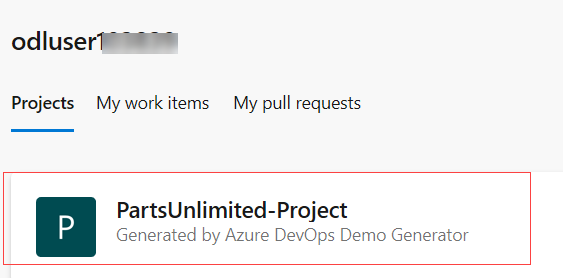
    

1. Navigate to **Pipelines**

    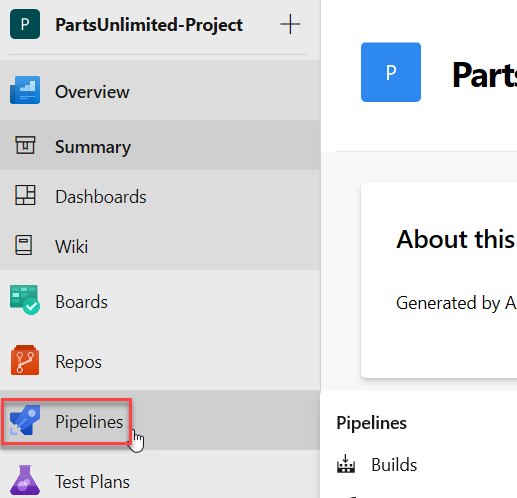
    

1. Click **+New and then new build pipeline** to create a new build pipeline.

    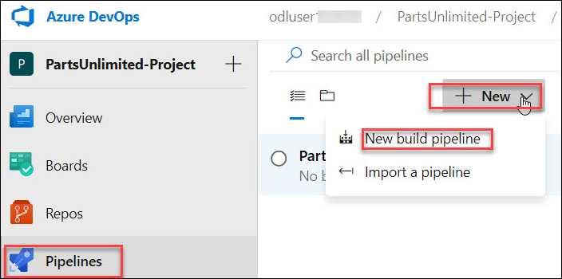
    

1. The default option for build pipelines involves using YAML to define the process. If you are interested in that, please check out that lab. For this lab, click **use the classic editor**.
    
    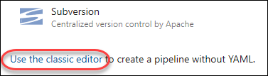
    
   

1. The first thing you'll need to do is to configure the source repository. Every major platform is available, but the default options are all we need here. This build will use the **master** branch of the **PartsUnlimited** repo. Leave the defaults and click **Continue**.

    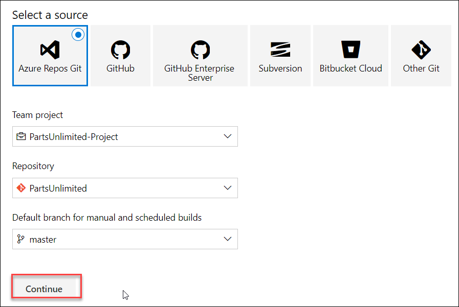
    

1. Locate the **ASP.NET** template and click **Apply** to apply this template to the build definition. Note that there are many options that should cover all of our mainstream scenarios. For our purposes here, we'll just build the project using the baseline ASP.NET template.

   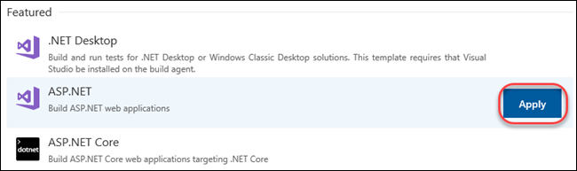
    

1. The process for this build pipeline is easy to follow. After getting the source, Azure DevOps will use NuGet to restore any dependent packages. Then, the project will be built and tested. The results will then be published to the configured target.

   
    

1. Select the **Variables** tab. Here you can configure special parameters to be used during the build, such as the configuration or platform.

   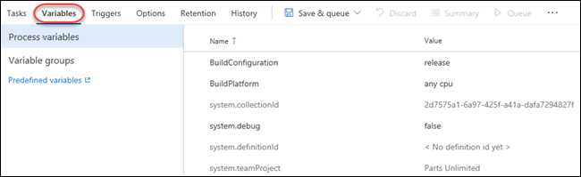
   

1. Select the **Triggers** tab. These triggers enable you to automatically invoke builds on a schedule, when another build completes, or when changes are made to the source. Check **Enable continuous integration** so that this build will get invoked whenever source changes are committed.

   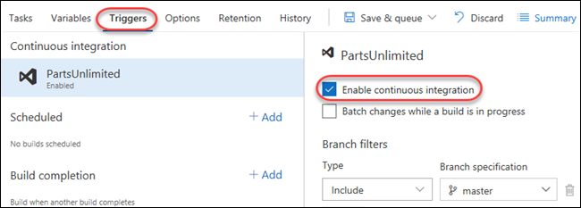
    

1. Select the **Options** tab. This section includes a wide variety of options related to the build workflow. Note that you'll generally configure options for specific build tasks on the configuration views of the tasks themselves.
    
   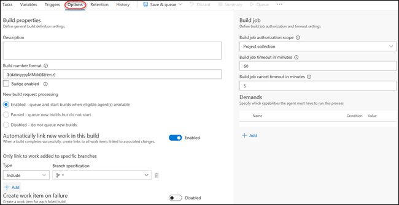
   
   

1. Select the **Retention** tab. Right-click **go to the project settings to configure** and select **Open in new tab**.
      
   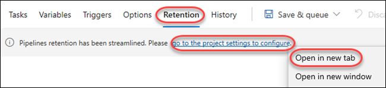
  
    

1. This section enables you to configure which pipeline runs are retained and for how long. Close the tab.

    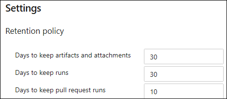

1. Select the **History** tab. There's nothing here yet, but it will show a history of changes you make to the build definition.

    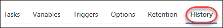

1. Select **Save & Queue | Save & Queue** to save and queue a new build.

    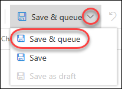
   

1. Accept the default options by clicking **Save and run**.

    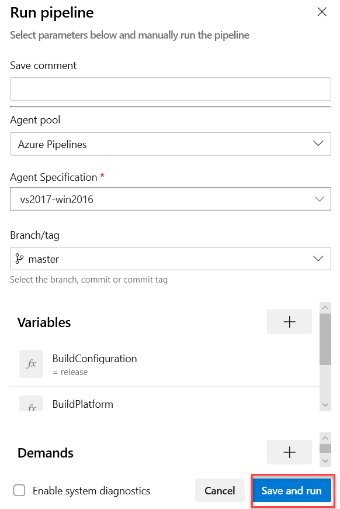

### Task 2: Tracking and reviewing a build ###

1. Depending on load, the build may need to wait in the queue for a moment.

    

1. Once the build begins, you'll be able to track the console output per task.

     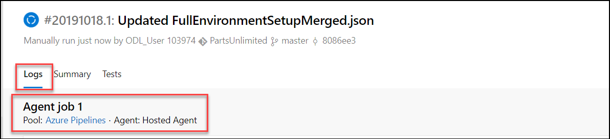

1. If you want to review an task, you can click on **logs** 
     
     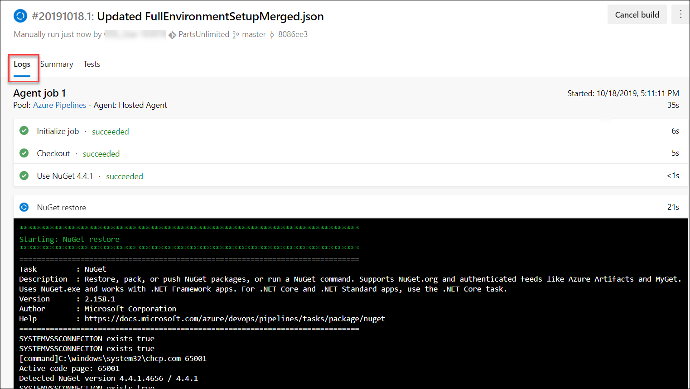

1. After the build process completes, you should see a green check mark next to each of the build pipeline steps.
     
     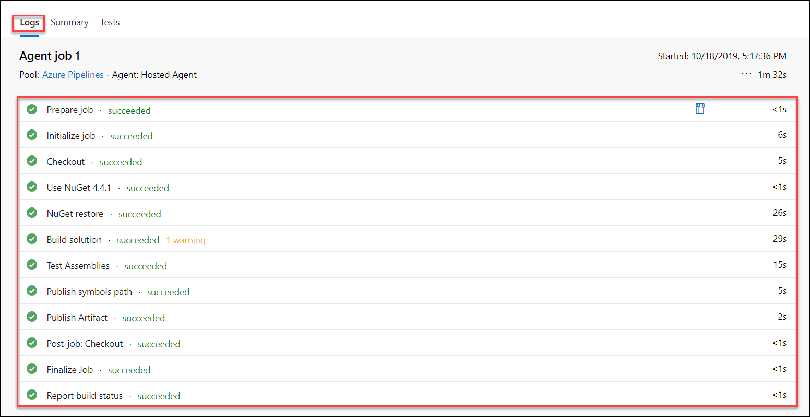

1. The summary view provides overview details about the build, including details about commits, tests, and artifacts.

     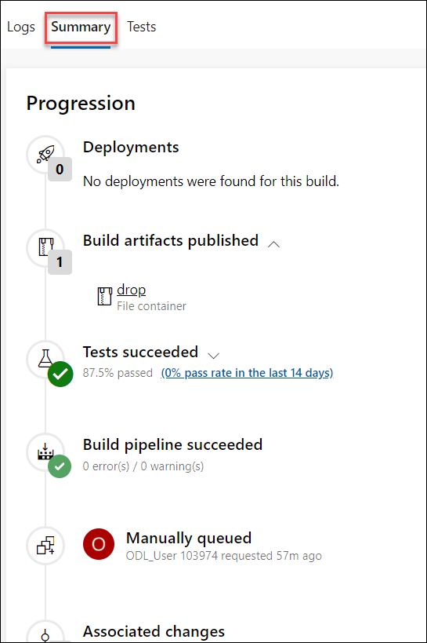

1. Select the **Tests** tab to review test performance for this build. Note that you also have easy access to the pipeline editor, the ability to queue a new build, and download the artifacts of this build.

    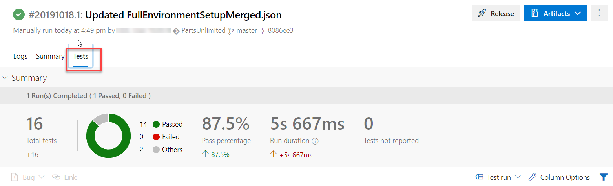
   

### Task 3: Invoking a continuous integration build ###

1. The build was configured earlier to support continuous integration. Navigate to the code for this project using **Repos | Files**.

   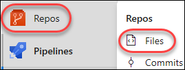

2. Open the file at **PartsUnlimited-aspnet45/src/PartsUnlimitedWebsite/Views/Home/Index.cshtml**.

   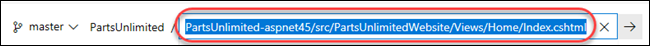

3. Click **Edit**.

   

    
4. Make a minor cosmetic change, such as by tweaking the title of the document. Click **Commit**.

   
  

5. Accept the default commit details and click **Commit**.

   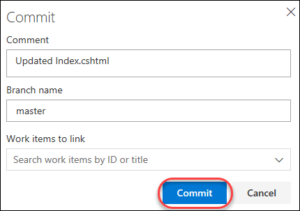
  

6. A build should be underway shortly. Select **Pipelines | Builds** to see if it's in progress.
   
   

7. You should now see that a new build (note the **.2**) is in progress and that it was triggered by your change. Click the build to    track it. Note that it may be queued behind another build pipeline configured for continuous integration.

   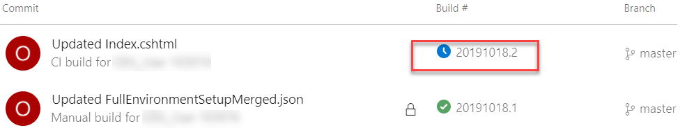
 

8. This build should run and succeed just like the previous build.

   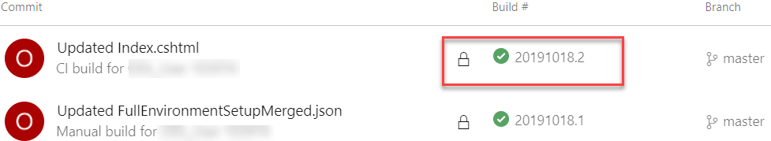
 
