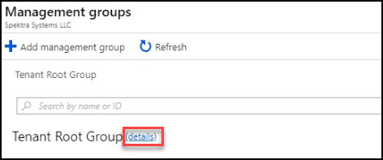
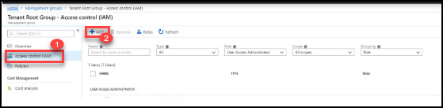
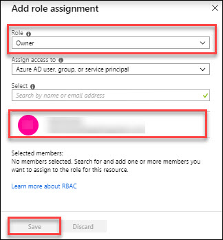

# Introduction

This is a supplement guide to ‘Microsoft Cloud Workshop - [Enterprise Ready Cloud](https://github.com/Microsoft/MCW-Enterprise-ready-cloud/blob/master/Hands-on%20lab/HOL%20step-by-step%20-%20Enterprise-ready%20cloud.md)’, to be used when you are delivering a hands-on-lab session using Cloud Labs AI platform from Spektra Systems. If you have any questions, please reach out to cloudlabs-support@spektrasystems.com

In the Enterprise Ready Cloud workshop, attendees will learn how to use Azure RBAC and Policy to help control usage within an Azure subscription, or across subscriptions using Management Groups. They will also learn how to use DevTest Labs, including setting up VPN access to the test environment.

# Verify the pre-provisioned Environment

## Verify Azure Access
Open a browser instance in private or incognito mode and login to [Microsoft Azure Portal](https://portal.azure.com) using the credentials provided.

> Note: You might have an existing Azure Credential. For the pre-provisioned environment, new Microsoft Azure environment is provisioned and new AAD user is created for you. To prevent conflict with your existing accounts, it is advised to use In Private mode of IE / Edge or Incognito mode of Chrome browser.

Also verify resource group **ODL-erc-41071** already created. In resource group **ODL-erc-41071** you will get Azure Environment with the **lab-vm** deployed in it. **41071**  is unique ID, so don't be confuse if yours is different.

## Verify Virtual Machine
You are provided a [Visual Studio cummunity- Windows 2016](https://azuremarketplace.microsoft.com/en-us/marketplace/apps/Microsoft.VisualStudioCommunity2017onWindowsServer2016x64?tab=Overview) with additional softwares configured with lab-vm named. FQDN of the virtual machine and administrator credentials are provided in the lab details page. You can remote into the virutal machine using the provided credentials and validate the following:

> Note: lab-vm is provisioned in the resource group **ODL-erc-41071**. Once you login to Microsoft Azure Portal, you can navigate to this VM to find more details.

# Known Issues
# Notes to attaindees 
To workaround manageent groups you must assign the owner role to your self. Follow the below steps:
1. After creating the **Enterprise Ready Cloud** management group in [Ex1 Task 1: Create a Management Group](https://github.com/Microsoft/MCW-Enterprise-ready-cloud/blob/master/Hands-on%20lab/HOL%20step-by-step%20-%20Enterprise-ready%20cloud.md#task-1-create-a-management-group). 
     
       1. Go to the Tenant root group details.
          <kbd></kbd>          
       2. Then click on **Access control (IAM)** and then **+Add**.
          <kbd></kbd> 
       3. Now give owner role to Azure Account you recieved in lab details page.
          <kbd></kbd> 
       4. If you are not able to add subscription in **Enterprise Ready Cloud** management group. Then move the subscription from **Tenant Root Group** to **Enterprise Ready Cloud** group.
          
            
# Notes to Instructors / Proctors

# Help and Support

If you require any help during the workshop, please reach out to the instructor / proctors. Instructors / proctors might escalate the issue to remote support team, at that time, please pass on your AAD User ID (aad_user_xyz), so that it is easier to look up your environment.
