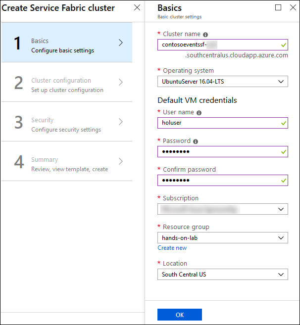
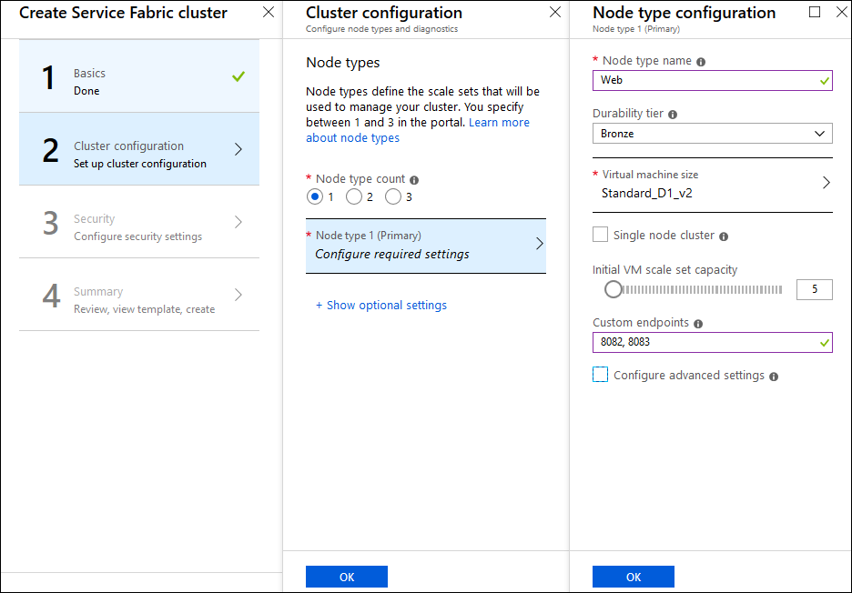
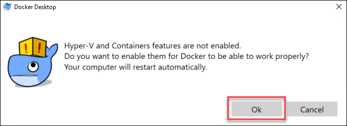

# Microservices-architecture-master-doc

## Before the hands-on lab
**Pre-Requisite:**
Once you receive the Lab Environment details after clicking on **Launch Lab**, perform the following task given below before starting with the main lab guide

Synopsis: In this exercise, you will set up your environment for use in the rest of the hands-on lab. You should follow all the steps provided in the Before the hands-on lab section to prepare your environment before attending the hands-on lab.

>**IMPORTANT**: Most Azure resources require unique names. Throughout these steps, you will see the word "SUFFIX" as part of resource names. You should replace this with your Microsoft alias, initials, or other value to ensure the resource is uniquely named.

### Task 1: Provision Service Fabric Cluster

In this task, you will provision the Service Fabric Cluster in Azure.

1.  In the Azure portal, select +Create a Resource, then type "Service Fabric" into the Search the Marketplace box. Select Service Fabric Cluster from the results.

    

2.  On the Service Fabric Cluster blade, select Create.

3.  On the Basics blade of the Create Service Fabric cluster screen, enter the following:

-   Cluster name: Enter **contosoeventssf-SUFFIX**, replacing SUFFIX with your alias, initials, or another value to make the name unique (indicated by a green check in the text box).

-   Operating system: Set to **UbuntuServer 16.04 LTS**

-   Username: Enter **holuser**.

-   Password: Enter **Password.1!!**

-   Subscription: Select the subscription you are using for this lab.

-   Resource Group: Select Create new, and enter **hands-on-lab** for the resource group name. You can add -SUFFIX, if needed to make resource group name unique. This is the resource group you will use for all resources you create for this hands-on lab.

-   Location: Select the region to use. Select the closest region to your current location.

-   Select OK.

    

4.  On the Cluster configuration blade, set the following:

-   Node type count: **Select 1**.

-   Node type 1 (Primary): **Select to configure required settings**. On the Node type configuration blade enter:

    -   Node type name: Enter **Web**.

    -   Durability tier: Leave **Bronze** selected.

    -   Virtual machine size: Select a VM size of **D1\_V2 Standard** and select Select on the Choose a size blade.

        
       

    -   Single node cluster: Leave unchecked.

    -   Initial VM scale set capacity: Leave set to **5**.

    -   Custom endpoints: Enter **8082, 8083**. This will allow the microservices to be accessible through the cluster.

    -   Configure advanced settings: Leave unchecked.

    -   Select OK on the Node type configuration blade.

    -   Select OK on the Cluster configuration blade.

    

5.  On the Security blade, you can provide security settings for your cluster. This configuration is completed up front, cannot be changed later. Set the following:

-   Configuration Type: Leave "Basic" selected.

-   Key vault: Select to configure required settings. On the Key vault configuration blade select "Create a new vault".

-   On the "Create key vault" configuration blade enter:

    -   Name: **hands-on-lab-SUFFIX**

    -   Resource Group: Select "Create new" and set the name as **hands-on-lab**
    
    -   Location: Use the same location as the first resource group you created.

        

-   Select "Create" on the Create key vault configuration blade. Wait for the key vault deployment to complete.

-   When the key vault deployment completes you will return to the Security configuration blade. You will see a warning that the key vault is not enabled for deployment. Follow these steps to resolve the warning:

    -   Choose "Edit access policies for hands-on-lab-SUFFIX".

    -   In the Access policies configuration blade, choose the link "Click to show advanced access policies".

    -   Check the "Enable access to Azure Virtual Machines for deployment" checkbox.

    -   Choose "Save". When the key vault update completes, close the Access policies blade.

        

    -   Enter **hands-on-lab-SUFFIX** as the certificate name. Then choose OK on the Security configuration blade.

6.  On the Summary blade, review the summary, and select Create to begin provisioning the new cluster.

    

7.  It can take up to 30 minutes or more to provision your Service Fabric Cluster. You can move on to the next task while you wait.

>**Note**: If you experience errors related to lack of available cores, you may have to delete some other compute resources, or request additional cores to be added to your subscription, and then try this again.

### Task 5: Install Docker for Windows

In this task, you will install Docker for Windows on your Lab VM.

1.  On your Lab VM, open a browser and navigate to: <https://download.docker.com/win/stable/Docker%20for%20Windows%20Installer.exe>.

2.  If prompted, select Save File to download the installer on the Lab VM.

    

3.  When finished, open the folder where the file was downloaded.

4.  Double-click the Docker for Windows Installer.exe file in order to run the installer.
    
    

5.  Follow the instructions to install the application.

6.  Once the Docker for Windows installation completes, select the Close and log out button.  This action will log out the current session.

7.  Reconnect to the LabVM virtual machine by repeating the step 5 in Task 3.

8.  When prompted, select Ok on the Docker Desktop dialog box that asks you if you want to enable Hyper-V and Containers features.  This action will restart the virtual machine.

    
    
9. Reconnect to the LabVM virtual machine by repeating the step 5 in Task 3.

10. Wait for Docker for Windows to start.  You can see its status on the icon in the tray bar.  When Docker starts successfully, it will display the Welcome window.

    

### Task 6: Install Service Fabric SDK for Visual Studio

In this task, you will install the latest Service Fabric SDK for Visual Studio on your Lab VM.

1.  On your Lab VM, open a browser, and navigate to: <https://docs.microsoft.com/azure/service-fabric/service-fabric-get-started>.

2.  Scroll down on the page to the Install the SDK and tools section and select **Install the Microsoft Azure Service Fabric SDK** under the To use Visual Studio 2017 heading.  Regardless of the heading, it can be installed on Visual Studio 2019.

    

3.  Run the downloaded executable and select Install in the Web Platform Installer screen.
   
    

4.  On the Prerequisites screen, select I Accept.

    

5.  Select Finish when the install completes.

    

6.  Select Exit on the Web Platform installer to close it.

7.  Restart the VM to complete the installation and start the local Service Fabric cluster service.

### Task 7: Setup Service Fabric certificate

When you create a new Service Fabric Cluster using the portal, a secure cluster is deployed. In order to later on be able to make use of it, a certificate setup is required.

In this task, you will download the required certificate and install it on your Lab VM.

1.  In the Azure portal, navigate to the Resource Group you created previously and where you created the Key vault that supports the cluster.

2.  Select the key vault from the list of resources in the resource group.

    

3.  Under the Settings category in the menu, select Certificates and then select the existing certificate.

    

4.  Select the Current Version of the existing certificate.

    

5.  In the certificate information blade, select Download in PFX/PEM format and save the certificate.

    

6.  Copy the downloaded certificate into the Lab VM.

7.  On the Lab VM, double-click the copied certificate to initiate its installation. Select Local Machine as the Store Location and select Next.

    

8.  Select Next.

    

9.  Select Next.

    

10. Select Next.

    

11. Select Finish.

    

12. When the import finishes successfully, select OK.

    

13. On the Lab VM, double-click the copied certificate once again to initiate its installation. Select Current User as the Store Location and select Next.

    

14. Select Next.

    

15. Select Next.

    

16. Select Next.

    

17. Select Finish.

    

18. When the import finishes successfully, select OK.

    

You should follow all steps provided *before* performing the Hands-on lab.

