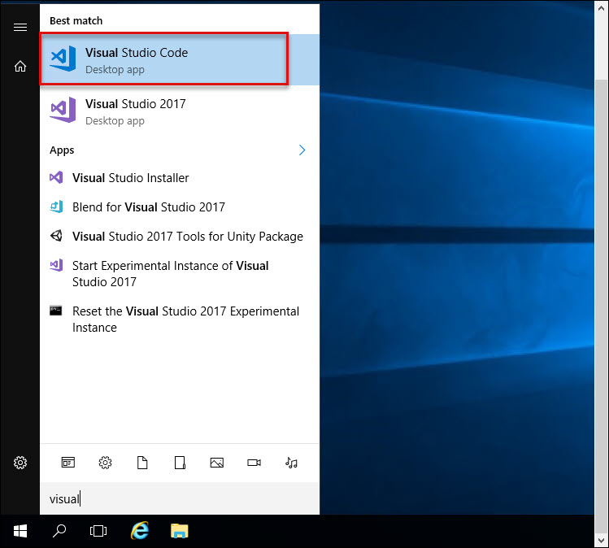
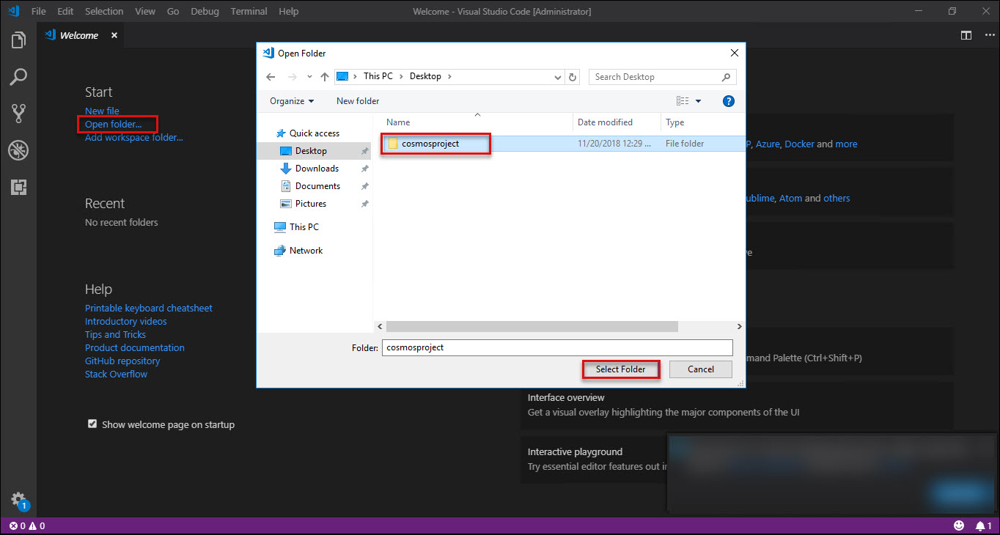

# Introduction

# Sign-up for Workshop Environment

To make it easier for you to work on the labs, you are provided with pre-provisioned Azure environment. You will receive sign-up link for the lab environment from your instructor. 

* Register for the lab environment by providing your information and clicking on **Submit** button.

* On the next page, click the **Launch Lab** button.
 
* Wait for the lab environment to be provisioned. Sometimes this can take upto **10 minutes**. Once environment provisioning is complete, you will receive details in email as well as in the browser.
 
 > Note: Lab environment is enabled only for specific duration or workshop end time - whichever is earlier. At the end of the allowed time, environment will be self-destructed. Also, for multi-day workshops, all virtual machines will be shutdown at 7 PM local time and start at 8AM local time.

# Verify the pre-provisioned Environment

* Open a browser instance in InPrivate / incognito mode and navigate to https://portal.azure.com 
* Login to the portal using Azure Credentials issued for your environment.  
* Once you are logged in to the portal, navigate to Resource Groups. 
* Note that you have access to one resource group:
  1. **ODL-cosmosdb-XXXXX-01** contains windows VM 
   [Note: For all tasks which involve deployment, use **ODL-cosmosdb-XXXXX-01** ]
  
* Navigate to the resource group and view the already existing resources such as Azure CosmosDB, Visual Studio CE 2017 on Windows Server 2016 virtual machine, etc.

## Verify Azure Access

Open a browser instance in private or incognito mode and login to [Microsoft Azure Portal](https://portal.azure.com) using the credentials provided.

> Note: You might have an existing Azure Credential. For the pre-provisioned environment, new Microsoft Azure environment is provisioned and new AAD user is created for you. To prevent conflict with your existing accounts, it is advised to use In Private mode of IE / IE Edge or Incognito mode of Chrome browser.

## Verify Virtual Machine

1. **Windows JumpVM** 
  OS: Visual Studio CE 2017 on Windows Server 2016
  You can RDP into this VM using the credentials and FQDN provided in the Lab details page.
  Verify that Git Bash and Putty is there in the Desktop, and Visual Studio Code is installed.

# Known Issues

You will not able to open project folder in visual studio code as per the lab guide, So please follow the below steps for opening the project folder in Visual Studio Code :

a. Search for Visual Studio Code from start **Menu** : 
 

b. Click on **Open Folder** then select the project folder : 
 

# Notes to Instructors / Proctors

# Help and Support

If you require any help during the workshop, please reach out to the instructor / proctors. Instructors / proctors might escalate the issue to remote support team, at that time, please pass on your AAD User ID (aad_user_xyz), so that it is easier to look up your environment.
