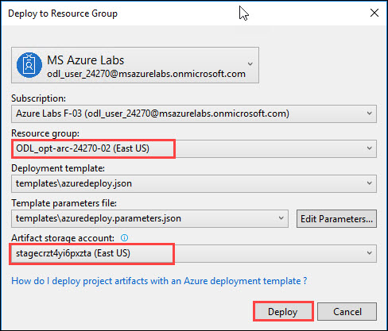

# Introduction
In this workshop, students will learn how to optimize a lift and shift style IaaS architecture in Azure to improve cost
savings. Students will also compare IaaS and PaaS hosting options to save cost even further through the use of Azure
App Service. Additionally, students will learn to improve resiliency and high availability through multi-region
deployment.  
# Sign-up for Workshop Environment

To make it easier for you to work on the labs, you are provided with pre-provisioned Azure environment. You will receive sign-up link for the lab environment from your instructor. 

* Register for the lab environment by providing your information and clicking on **Submit** button.

* On the next page, click the **Launch Lab** button.
 
* Wait for the lab environment to be provisioned. Sometimes this can take upto **10 minutes**. Once environment provisioning is complete, you will receive details in email as well as in the browser.
 
 > Note: Lab environment is enabled only for specific duration or workshop end time - whichever is earlier. At the end of the allowed time, environment will be self-destructed. Also, for multi-day workshops, all virtual machines will be shutdown at 7 PM local time and start at 8AM local time.  

# Verify the pre-provisioned Environment

## Verify Azure Access

Open a browser instance in private or incognito mode and login to [Microsoft Azure Portal](https://portal.azure.com) using the credentials provided.In Azure portal you can navigate to the Resource groups to see the 7 pre-deployed Resource groups.
* You should use the existing Resource groups during the lab.
* Navigate to each Resource group and verify that all the pre-deployed resources are in **Resource group-01 and Resource group-02** and other five Resource groups are empty.

> Note: You might have an existing Azure Credential. For the pre-provisioned environment, new Microsoft Azure environment is provisioned and new AAD user is created for you. To prevent conflict with your existing accounts, it is advised to use In Private mode of IE / IE Edge or Incognito mode of Chrome browser.

## Verify Virtual Machine
You are provided a **Visual Studio Community 2017 on Windows Server 2016 (x64)** in Resource group-01 with additional softwares configured. Administrator credentials of the virtual machine is provided in the lab details page. You can remote into the virutal machine using the provided credentials.

> Note: VM is provisioned in the resource group, in which you have access. Once you login to Microsoft Azure Portal, you can navigate to this VM to find more details.
## Verify pre-requisite Azure resources 
1. **Virtual Network**
2. **Public IP**
3. **Network Interface**
4. **Network Security Group** 
5. **Storage Accounts** in Resource group-01
6. **Storage Accounts** in Resource group-02

## Notes to Attendees
#### While doing **Before the Hands-on-lab** section, follow the below mentioned steps.
1. Do not create **Virtual Machine** specified in **Task 1**, since it is pre-created.
2. You can skip **Task 2** and **Task 3**, since all the configurations specified are already completed. 
3. In **Task 4**, replace **Step 4** with the following step:
* Click on the Resource group dropdown, followed by selecting **Resource group-02**. In the artifact **storage account** section, **Select** storage account with the name starting with **Stage** and Click on **Deploy**.

4. You can skip **Step 5** and **Step 6**.
5. While creating **Traffic Manager** specified in **Exercise 1**>**Task 1**, you need to select **Use Existing** under **Resource group** option and select **Resource group - 03** from the drop down.
6. While creating **API App** specified in **Exercise 3**>**Step 1**, you need to select **Use Existing** under **Resource group** option and select **Resource group - 04** from the drop down.
7. While creating **Web App** specified in **Exercise 4**>**Step 1**, you need to select **Use Existing** under **Resource group** option and select **Resource group - 05** from the drop down.
8. While creating **Web App** specified in **Exercise 5**>**Step 1**, you need to select **Use Existing** under **Resource group** option and select **Resource group - 06** from the drop down.
9. While creating **Scheduler** specified in **Exercise 5**>**Step 3**>**11**, you need to select **Use Existing** under **Resource group** option and select **Resource group - 06** from the drop down.
10. While creating **Web App** specified in **Exercise 8**>**Step 1**, you need to select **Use Existing** under **Resource group** option and select **Resource group - 07** from the drop down.  
# Known Issues

# Notes to Instructors / Proctors

# Help and Support

If you require any help during the workshop, please reach out to the instructor / proctors. Instructors / proctors might escalate the issue to remote support team, at that time, please pass on your AAD User ID (aad_user_xyz), so that it is easier to look up your environment.
