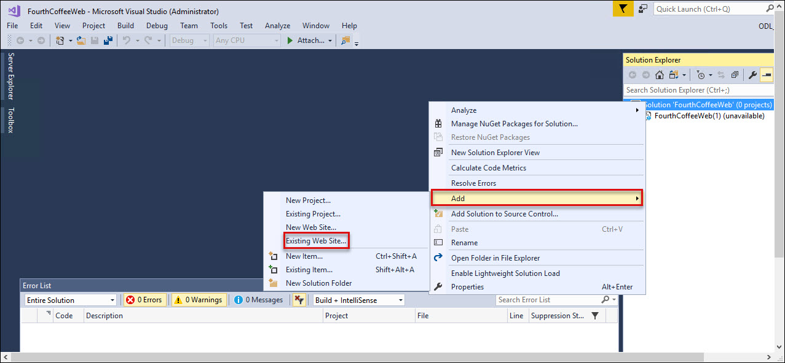
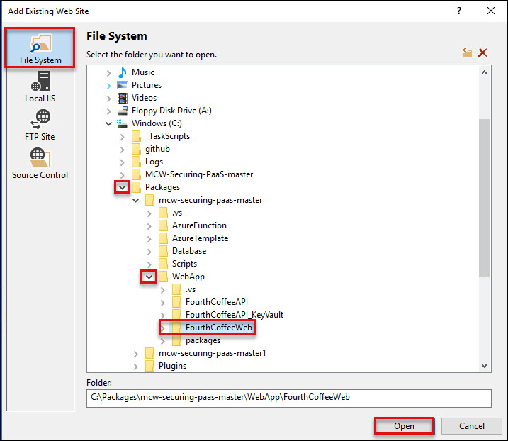
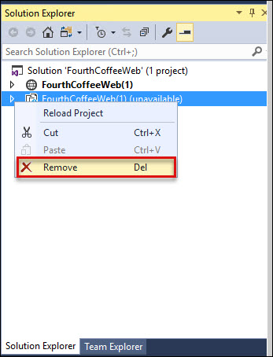

# Introduction

This is a supplement guide to ‘Microsoft Cloud Workshop - [Secure Paas](https://github.com/Microsoft/MCW-Securing-PaaS/blob/master/Hands-on%20lab/HOL%20step-by%20step%20-%20Securing%20PaaS.md)’, to be used when you are delivering a hands-on-lab session using Cloud Labs AI platform from Spektra Systems. If you have any questions, please reach out to cloudlabs-support@spektrasystems.com

In this hands-on lab, attendees will implement several of the PaaS security features of Azure to help ensure a secure application environment.

# Verify the pre-provisioned Environment

## Verify Azure Access

Open a browser instance in private or incognito mode and login to [Microsoft Azure Portal](https://portal.azure.com) using the credentials provided.In Azure portal you can navigate to the Resource groups to see the pre-deployed Resource group.
* You should use the existing Resource group during the lab.

> Note: You might have an existing Azure Credential. For the pre-provisioned environment, new Microsoft Azure environment is provisioned and new AAD user is created for you. To prevent conflict with your existing accounts, it is advised to use In Private mode of IE / IE Edge or Incognito mode of Chrome browser.

## Verify Virtual Machine

You are provided a Visual Studio CE 2017 on Windows Server 2016 with additional softwares configured. Administrator credentials are provided in the lab details page. You can remote into the virutal machine using the provided credentials and validate the following:

> Note: labvm is provisioned in the resource group, in which you have access. Once you login to Microsoft Azure Portal, you can navigate to this VM to find more details.

## Verify the pre-requisite Azure resources
Following azure resources are created for you in advance, Please use them instead of creating more resources. 
1. **SQL Database** 
2. **SQL Server**   
3. **Virtual Network**
4. **Public IP**
5. **Network Interface**
6. **Storage accounts**
7. **Route Table**
8. **App Service Plan**

# Known Issues

Follow the given steps if you are getting error while opening folder \Hands-on lab\WebApp\FourthCoffeeWeb.sln in **Exercise 6 > Task 1 > step 10**:

1. Right click on **Solution** then select add and open **Existing Web Site**. 
 
2. In Existing Web Site, drop down WebApp folder and open **FourthCoffeeWeb**. 
 
3. Know you can see project under solution 
 
4. Remove the unavailable **FourthCoffeeWeb** folder from Solution. 
. 

# Notes to Instructors / Proctors
* Attendees can refer **Registration Page/Email** for all details of the resources deployed.   

# Help and Support

If you require any help during the workshop, please reach out to the instructor / proctors. Instructors / proctors might escalate the issue to remote support team, at that time, please pass on your AAD User ID (aad_user_xyz), so that it is easier to look up your environment.
