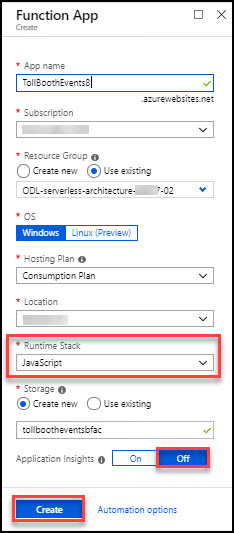

# Introduction

# Sign-up for Workshop Environment

To make it easier for you to work on the labs, you are provided with pre-provisioned Azure environment. You will receive sign-up link for the lab environment from your instructor. 

* Register for the lab environment by providing your information and clicking on **Submit** button.

* On the next page, click the **Launch Lab** button.
 
* Wait for the lab environment to be provisioned. Sometimes this can take upto **10 minutes**. Once environment provisioning is complete, you will receive details in email as well as in the browser.
 
 > Note: Lab environment is enabled only for specific duration or workshop end time - whichever is earlier. At the end of the allowed time, environment will be self-destructed. Also, for multi-day workshops, all virtual machines will be shutdown at 7 PM local time and start at 8AM local time.

# Verify the pre-provisioned Environment

## Verify Azure Access

Open a browser instance in private or incognito mode and login to [Microsoft Azure Portal](https://portal.azure.com) using the credentials provided.

> Note: You might have an existing Azure Credential. For the pre-provisioned environment, new Microsoft Azure environment is provisioned and new AAD user is created for you. To prevent conflict with your existing accounts, it is advised to use In Private mode of IE / IE Edge or Incognito mode of Chrome browser.

Also verify two resource groups **ODL_serverless-architecture-XXXXX-01** and **ODL_serverless-architecture-XXXXX-02** already created. In resource group **ODL_serverless-architecture-XXXXX-01** you will get Azure Environment with the LABVM deployed in it

## Verify Virtual Machine

You are provided a [Visual Studio cummunity- Windows 2016](https://azuremarketplace.microsoft.com/en-us/marketplace/apps/Microsoft.VisualStudioCommunity2017onWindowsServer2016x64?tab=Overview) with additional softwares configured with jumpvm named. FQDN of the virtual machine and administrator credentials are provided in the lab details page. You can remote into the virutal machine using the provided credentials and validate the following:

> Note: jumpvm is provisioned in the resource group, in which you have access. Once you login to Microsoft Azure Portal, you can navigate to this VM to find more details.  

## Notes to Attendees
While doing **Before the Hands-on-lab** section, follow the below steps.
1. You can skip **Task 1** in **Before the Hands-on-lab** section, since it is pre-created. You can use the pre-created resources during the lab.
2. You should perform **Task 2**. In this task, you will **Disable IE Enhanced Security**
3. You should perform **Task 3, Task 4 and Task 5**.
4. You can skip **Task 6**, since the required resource groups are pre-created. You should create all the resource for the lab in **ODL_serverless-architecture-XXXXX-02** resource group.
5. When you deploy **Function App** in exercise 1 - task 2. Choose **Java Script** instead of .net in RunTime Stack
<kbd></kbd>
6. In Exercise 2- task 1 step 4, configure **computerVisionApiUrl** as **https://australiaeast.api.cognitive.microsoft.com/vision/v1.0/ocr**. Here just modify the endpoint(https://australiaeast.api.cognitive.microsoft.com/) of your computer vision endpoint url.
# Known Issues

### Not showing Telemetry data in sample Telemetry under App Insight, Lab guide page number: 55 and further steps of App Insight.
Please re-verify previous steps of lab, most likely you missed some configuration part.

### Connecting DSVM with RDP having issue addresses CredSSP

> **Possible Solutions**:

* With the release of the March 2018 Security bulletin, there was a fix that addressed a CredSSP, “Remote Code Execution” vulnerability (CVE-2018-0886) which could impact RDP connections. 
**Resolution**
Please follow the instruction under https://github.com/SpektraSystems/Microsoft-Cloud-Workshop/blob/master/RDP%20CredSSP/README.md

# Notes to Instructors / Proctors

# Help and Support

If you require any help during the workshop, please reach out to the instructor / proctors. Instructors / proctors might escalate the issue to remote support team, at that time, please pass on your AAD User ID (aad_user_xyz), so that it is easier to look up your environment.

