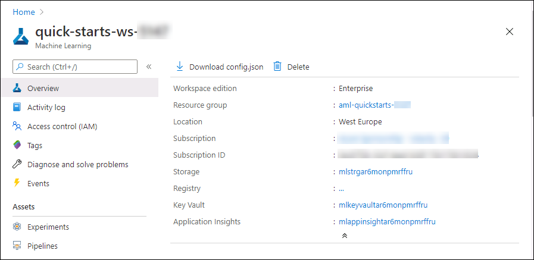

### **Getting Started**

1. If you are logged in into Azure portal please click on **Next** button  in bottom right corner.  
<kbd></kbd>  

2. If you are not logged in into azure portal ,  From the desktop click on the **ML studio** icon  to sign in into the Machine Learning studio and login to Azure with the following credentials:

Username:**<inject key="AzureAdUserEmail" />** 

Password:**<inject key="AzureAdUserPassword" />** 

   and Click on **Sign in**.

3. Select the subscription and your machine learning workspace starts with **quick-start-ws**

